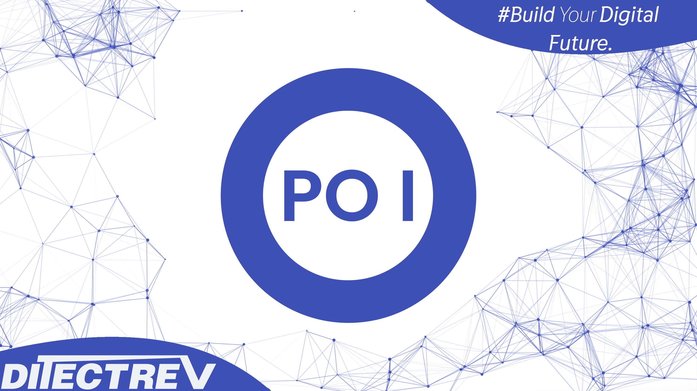

# ⬆️ Professional Scrum Product Owner (PSPO I) Practice Tests Exams Questions & Answers

## Udemy

❣️ Please support us by purchasing this course on Udemy in an interactive version with the [discounted link](https://www.udemy.com/course/professional-scrum-product-owner-pspo-i-practice-test-exam/?referralCode=07DC7B5304A2D16BC654). If you're working for a company, you could most probably easily claim this expense during preparation for your exam. For us, it's to be, or not to be, in the game.

## ✨ This course is unlike any Professional Scrum Product Owner (PSPO I) course you will find online.

✋ Join a live online community and a course taught by industry experts and pass the Professional Scrum Product Owner (PSPO I) confidently. We aim to build an ecosystem of Information Technology (IT) certifications and online courses in cooperation with the technology industry. We believe it will give our students 100% confidence in the pacing market in an open-source environment. We are just at the beginning of our way, so it's even better for you to join now!

## ⌛️ Short and to the point; why should you take the course:

1. Always happy to answer your questions on Udemy's Q&A's and outside :)
2. Failed? Please submit a screenshot of your exam result and request a refund (via our upcoming platform, not possible on Udemy); we'll always accept it.
3. Learn about topics, such as:
   - Accountability in Scrum;
   - Definition of Done (DoD);
   - Product Backlog;
   - Product Goal;
   - Scrum;
   - Scrum Daily;
   - Scrum Team;
   - Scrum Value;
   - Self-management;
   - Sprint Backlog;
   - Sprint Planning;
   - Sprint Retrospective;
   - Sprint Review;
   - **Much More!**
4. Questions are similar to the actual exam, without duplications (like in other courses ;-)).
5. The Practice Tests Exams simulate the actual exam's content, timing, and percentage required to pass the exam.
6. This course is **not** a Professional Scrum Product Owner (PSPO I) Exam Dump. Some people use brain dumps or exam dumps, but that's absurd, which we don't practice.
7. 264 **unique** questions.

## ☝️ Course Updates

**[v1.0.0](https://github.com/Ditectrev/Professional-Scrum-Product-Owner-PSPO-I-Practice-Tests-Exams-Questions-Answers/releases/tag/v1.0.0): January 25, 2023.**

- Launch of the course.

## 🙋‍♀️ & 🙋‍♂️ Contribution

We are so thankful for every contribution, which makes sure we can deliver top-notch content. Whenever you find a missing resource, broken link in a [Table of Contents](https://github.com/Ditectrev/Professional-Scrum-Product-Owner-PSPO-I-Practice-Tests-Exams-Questions-Answers#table-of-contents), the wrong answer, please submit an [issue](https://github.com/Ditectrev/Professional-Scrum-Product-Owner-PSPO-I-Practice-Tests-Exams-Questions-Answers/issues). Even better would be a [Pull Request (PR)](https://github.com/Ditectrev/Professional-Scrum-Product-Owner-PSPO-I-Practice-Tests-Exams-Questions-Answers/pulls).

## Who this course is for:

- 👨‍🎓 Students preparing for the Professional Scrum Product Owner (PSPO I) Exam;
- 👨‍🎓 Agile Coaches;
- 👨‍🎓 Agile Leaders;
- 👨‍🎓 DevOps Engineers;
- 👨‍🎓 IT Professionals;
- 👨‍🎓 Lead Engineers;
- 👨‍🎓 Scrum Masters;
- 👨‍🎓 Software Developers/Engineers;
- 👨‍🎓 Software Testers;
- 👨‍🎓 Product Managers;
- 👨‍🎓 Product Owners;
- 👨‍🎓 Project Managers;
- 👨‍🎓 Team Leaders.

## Requirements

- 🤩 Excitement to learn!
- 0️⃣ Prior knowledge is required;
- ✅ You can pass the Professional Scrum Product Owner (PSPO I) Exam solely based on our Practice Tests Exams.

## Table of Contents

| No. | Questions |
| --- | --------------------------- |
| 1   | [A Scrum Team has been working on a product for 9 Sprints. A new Product Owner who is new to Scrum joins the team and understands she is accountable for the Product Backlog. However, she is unsure about the purpose of the Product Backlog. She has read that the Product Backlog should be a list of all user features for the product. She goes to the Scrum Master asking where to put the other types of requirements that are going to be taken into account. Are all of the following types of requirements acceptable on a Product Backlog? Stability requirements. Performance requirements. Product Functionality. Documentation. Fixes. (choose the best answer)](#a-scrum-team-has-been-working-on-a-product-for-9-sprints-a-new-product-owner-who-is-new-to-scrum-joins-the-team-and-understands-she-is-accountable-for-the-product-backlog-however-she-is-unsure-about-the-purpose-of-the-product-backlog-she-has-read-that-the-product-backlog-should-be-a-list-of-all-user-features-for-the-product-she-goes-to-the-scrum-master-asking-where-to-put-the-other-types-of-requirements-that-are-going-to-be-taken-into-account-are-all-of-the-following-types-of-requirements-acceptable-on-a-product-backlog-stability-requirements-performance-requirements-product-functionality-documentation-fixes-choose-the-best-answer) |
| 5   | [What variables should a Product Owner consider when ordering the Product Backlog? (choose the best answer)](#what-variables-should-a-product-owner-consider-when-ordering-the-product-backlog-choose-the-best-answer) |
| 6   | [It is mandatory for the Product Owner to monitor and share progress of the Product Backlog by using which method? (choose the best answer)](#it-is-mandatory-for-the-product-owner-to-monitor-and-share-progress-of-the-product-backlog-by-using-which-method-choose-the-best-answer) |
| 8   | [The Product Owner manages the Product Backlog. Who is accountable for estimating the effort to complete the Product Backlog Items? (choose the best answer)](#question8) |
| 13   | [True or False: The Sprint Review is the only time at which stakeholder feedback is taken into account.](#question13) |
| 19   | [How do timeboxes help the Product Owner and the other members of the Scrum Team validate assumptions, adapt, and maximize the value of their product?](#question19) |
| 25   | [True or False: The value delivered by a product can only be determined by revenue.](#question25) |
| 28   | [True or False: The Scrum Team must choose at least one high priority process improvement item, identified during the Sprint Retrospective, and place it in the Sprint Backlog.](#question28) |
| 31   | [When can the Product Backlog be updated? (choose the best answer)](#question31) |
| 33   | [True or False: The Product Owner should have the entire Product Backlog documented in detail before the first Sprint can start?](#question33) |
| 34   | [True or False: The Sprint Backlog is a result of Sprint Planning, and it includes the Sprint Goal.](#question34) |
| 35   | [Who is accountable for creating a valuable and usable Increment each Sprint? (choose the best answer)](#question35) |
| 36   | [What are two effective ways for the Scrum Team to make non-functional requirements visible? (choose the best two answers)](#question36) |
| 38   | [The Cone of Uncertainty can be used to do what? (choose the best answer)](#question38) |
| 41   | [Which is NOT a valid consideration when ordering a Product Backlog? (choose the best answer)](#question41) |
| 42   | [True or False: The Product Owner must write all of the Product Backlog Items (e.g. user stories, requirements, etc.) on the Product Backlog before handing them over to the Scrum Team.](#question42) |
| 43   | [Which of the following are criteria to order Product Backlog Items? (choose all that apply)](#question43) |
| 52   | [All Scrum artifacts must be transparent to ensure sufficient accuracy of inspection. Which two measures ensure that the Product Backlog is transparent? (choose the best two answers)](#question52) |
| 53   | [Why is it important that there is only one Product Owner per product? (choose the best three answers)](#question53)|
| 54   | [Which of the following practices might help the Product Owner minimize waste in developing and sustaining the Product Backlog? (choose the best two answers)](#question54) |
| 55   | [True or False: Product Owners must create clear and unambiguous acceptance criteria for each Product Backlog Item before it may be selected in Sprint Planning.](#question55) |
| 56   | [What three things might a Scrum Product Owner focus on to ensure the product delivers value? (choose the best three answers)](#question56) |
| 57   | [How often should customer satisfaction be measured? (choose the best answer)](#question57) |
| 58   | [Why would you expect a Product Owner to care that the Scrum Team adheres to its Definition of Done? (choose the best two answers)](#question58) |
| 59   | [A product's success is measured by: (choose the best three answers)](#question59) |
| 60   | [True or False: Dependencies could influence how the Product Owner orders Product Backlog Items.](#question60) |
| 61   | [Scrum is based on empiricism. All of its artifacts must be transparent to ensure sufficient accuracy of inspection. How can the Scrum Team maintain the Product Backlog to maximize its transparency? (choose the best answer)](#question61) |
| 62   | [What is the responsibility of the Product Owner in crafting the Sprint Goal? (choose the best answer)](#question62) |
| 63   | [When should the Product Owner update the project plan? (choose the best answer)](#question63) |
| 64   | [A Product Backlog is: (choose the best three answers)](#question64) |
| 65   | [How much time must a Product Owner spend with the Developers? (choose the best answer)](#question65) |
| 66   | [Which metrics will help a Product Owner determine if a product delivering value? (choose the best two answers)](#question66) |
| 68   | [True or False: All planned work for the Product done by the Scrum Team must originate from the Product Backlog.](#question68) |
| 69   | [What typically happens if the Product Backlog is not sufficiently clear at Sprint Planning? (choose the best answer)](#question69) |
| 70   | [True or False: During the Sprint Review the stakeholder's role is to reorder the Product Backlog.](#question70) |
| 71   | [True or False: A Product Owner can measure success by an increase in the team's velocity.](#question71) |
| 72   | [What might indicate to a Product Owner that she needs to work more with the Scrum Team? (choose the best answer)](#question72) |
| 73   | [What are two effective ways for a Scrum Team to ensure security concerns are satisfied? (choose the best two answers)](#question73) |
| 74   | [You are the Scrum Master for four Scrum Teams working from the same Product Backlog. Several of the Developers come to you complaining that work identified for the upcoming two Sprints will require full-time commitment from a specialist who is external to the teams. What should the Scrum Master consider in this situation? (choose the best two answers)](#question74) |
| 75   | [In order to maximize the value of the product, a Product Owner needs awareness of the following: (choose the best answer)](#question75) |
| 76   | [The Developers ask their Product Owner to re-order the Product Backlog. The team is waiting for an external supplier to deliver a component. Without that component there will not be enough work in the next Sprint to occupy the full team. As the Scrum Master, what advice would you give the Product Owner? (choose the best answer)](#question76) |
| 77   | [A Project Manager working with your Scrum Team has raised concerns about progress and money spent. What are the two best responses? (choose the best two answers)](#question77) |
| 78   | [The Product Owner is the person who will be held accountable if a product does not achieve its goals or deliver value. Does this mean that the Product Owner has final say over the Definition of Done? (choose the best answer)](#question78) |
| 79   | [Which statement best describes Scrum? (choose the best answer)](#question79) |
| 80   | [What is a Product Owner typically responsible for during a Sprint? (choose the best two answers)](#question80) |
| 81   | [True or False: Product Owners must specify complete acceptance criteria for a Product Backlog Item before the Developers can select the item in Sprint Planning.](#question81) |
| 82   | [Who is accountable for tracking the remaining work toward the Sprint Goal? (choose the best answer)](#question82) |
| 83   | [The Scrum Team should have all the skills needed to: (choose the best answer)](#question83) |
| 84   | [Which three of the following are timeboxed events in Scrum? (choose the best three answers)](#question84) |
| 85   | [Who starts the Daily Scrum? (choose the best answer)](#question85) |
| 86   | [Which of the following services are appropriate for a Scrum Master in regard to the Daily Scrum? (choose the best answer)](#question86) |
| 87   | [True or False: Sprint Reviews are an opportunity to collect stakeholder feedback.](#question87) |
| 88   | [Who is on the Scrum Team? (choose all that apply)](#question88) |
| 89   | [What tactic should a Scrum Master use to divide a group of 100 people into multiple Scrum Teams? (choose the best answer)](#question89) |
| 90   | [Which of the following are true about the length of the Sprint? (choose the best answer)](#question90) |
| 91   | [Which are appropriate topics for discussion in a Sprint Retrospective? (choose the best three answers)](#question91) |
| 92   | [True or False: The Product Owner makes sure the correct stakeholders are invited to the Sprint Retrospective. They might have important instructions for team improvements.](#question92) |
| 93   | [Who has the final decision about the order of items in the Product Backlog? (choose the best answer)](#question93) |
| 94   | [What are the two primary ways a Scrum Master helps a Scrum Team work at its highest level of productivity? (choose the best two answers)](#question94) |
| 95   | [During a Sprint, when is new work or further decomposition of work added to the Sprint Backlog? (choose the best answer)](#question95) |
| 96   | [True or False: A high-performance Scrum Team ensures that each Increment is complete by running a Release Sprint.](#question96) |
| 97   | [The Developers select a set of Product Backlog Items for a Sprint Backlog with the intent to get the selected items done by the end of the Sprint. Which three phrases best describe the purpose of a Definition of Done? (choose the best three answers)](#question97) |
| 98   | [What are three benefits of self-management? (choose the best three answers)](#question98) |
| 99   | [A new Developer is having continuing conflicts with existing members of the Scrum Team, which is impacting the delivery of the Increment. If necessary, who is responsible for removing the Developer from the Scrum Team? (choose the best answer)](#question99) |
| 100   | [A Product Owner is accountable for maximizing the value of the product that is the result of the work of the Scrum Team. Which of the following can be delegated to others, while the Product Owner remains accountable for the work? (choose the best two answers)](#question100) |
| 101   | [During a Sprint Retrospective, the Developers propose moving the Daily Scrum to only occur on Tuesdays and Thursdays. Which two are the most appropriate responses for the Scrum Master to recommend? (choose the best two answers)](#question101) |
| 102   | [During the Sprint Retrospective a Scrum Team has identified several high priority process improvements. Which of the following statements is most accurate? (choose the best answer)](#question102) |
| 103   | [How is management that is external to the Scrum Team involved in the Daily Scrum? (choose the best answer)](#question103) |
| 104   | [How much time is required after a Sprint to prepare for the next Sprint? (choose the best answer)](#question104) |
| 105   | [How much work is required of the Developers to complete a Product Backlog Item selected during the Sprint Planning? (choose the best answer)](#question105) |
| 106   | [How often should Scrum Team membership change? (choose the best answer)](#question106) |
| 107   | [If Product Backlog Refinement is needed, when is the ideal time for refinement to take place and who should participate? (choose the best two answers)](#question107) |
| 108   | [Scrum requires that the Product Owner must use which of the following items? (choose all that apply)](#question108) |
| 109   | [True or False: A Product Owner with multiple teams working on one product should maintain separate Product Backlogs for each team.](#question109) |
| 110   | [True or False: The Scrum Team is accountable for releasing the most valuable product.](#question110) |
| 111   | [What are three advantages of a Product Owner sharing a clearly defined Product Goal with the Scrum Team? (choose the best three answers)](#question111) |
| 112   | [Which approach is best for Scrum Teams in order to produce valuable Increments? (choose the best answer)](#question112) |
| 113   | [Who is accountable for managing the progress of work during a Sprint? (choose the best answer)](#question113) |
| 114   | [Who is part of the discussion about which Product Backlog Items are selected for a Sprint? (choose the best answer)](#question114) |
| 115   | [Why does the Product Owner want the Developers to adhere to its Definition of Done? (choose the best answer)](#question115) |
| 116   | [Your management has asked you to take the lead in the development of a new product. Six teams new to Scrum will build this product. You have gathered a number of requirements and ideas into an early form of a Product Backlog. How would you minimize dependencies between the Scrum Teams? (choose the best answer)](#question116) |
| 117   | [What does it mean to say that an event has a timebox? (choose the best answer)](#question117) |
| 118   | [True or False: A Scrum Master fulfills the same role as a traditional Project Manager.](#question118) |
| 119   | [When is it most appropriate for a Scrum Team to change the Definition of Done? (choose the best answer)](#question119) |
| 120   | [True or False: A Product Owner should measure product value by the increase in the team's velocity.](#question120) |
| 121   | [Why do the Developers need a Sprint Goal? (choose the best answer)](#question121) |
| 122   | [Who creates a Product Backlog Item's estimate? (choose the best answer)](#question122) |
| 123   | [True or False: Every Scrum Team must have a Product Owner and a Scrum Master.](#question123) |
| 124   | [Which topics should be discussed in the Sprint Review? (choose the best answer)](#question124) |
| 125   | [Five new Scrum Teams have been created to build one product. A few of the Developers on one of the Scrum Teams ask the Scrum Master who will coordinate the work with the other teams. What should the Scrum Master do? (choose the best answer)](#question125) |
| 126   | [True or False: Cross-functional teams are optimized to work on one component or layer of a system only.](#question126) |
| 127   | [What are two responsibilities of Testers in a Scrum Team? (choose the best two answers)](#question127) |
| 128   | [Which two ways of creating Scrum Teams are consistent with Scrum's values? (choose the best two answers)](#question128) |
| 129   | [True or False: The Scrum Team is accountable for creating a valuable Increment every Sprint.](#question129) |
| 130   | [When does the next Sprint begin? (choose the best answer)](#question130) |
| 131   | [True or False: An Increment must be released to customers or users at the end of each Sprint.](#question131) |
| 132   | [What is the accountability of the Product Owner during Sprint 0? (choose the best answer)](#question132) |
| 132   | [True or False: When there are multiple teams working on one product, each Scrum Team should have a separate Product Owner.](#question132)
| 133   | [Which answer best describes the topics covered in Sprint Planning? (choose the best answer)](#question133) |
| 134   | [Which of the following might the Scrum Team discuss during a Sprint Retrospective? (choose the best answer)](#question134) |
| 135   | [An organization has decided to adopt Scrum, but management wants to change the terminology to fit with terminology already used. What will likely happen if this is done? (choose the best answer)](#question135) |
| 136   | [Which three of the following are feedback loops in Scrum? (choose the best three answers)](#question136) |
| 137   | [The IT manager asks the Scrum Team for a status report describing the progress throughout the Sprint. The Scrum Team ask the Scrum Master for advice. The Scrum Master should: (choose the best answer)](#question137) |
| 138   | [What happens if the Scrum Team cannot complete its work by the end of the Sprint? (choose the best answer)](#question138) |
| 139   | [User documentation is part of your Definition of Done. However, there are not enough Technical Writers for all teams. Your Scrum Team does not have a Technical Writer. What should the Scrum Team do? (choose the best answer)](#question139) |
| 140   | [The Scrum Master observes the Product Owner is struggling with ordering the Product Backlog. What is an appropriate action for the Scrum Master to take? (choose the best answer)](#question140) |
| 141   | [When must the Product Owner be present at the Daily Scrum? (choose the best answer)](#question141) |
| 141   | [How much of the Sprint Backlog must be defined during the Sprint Planning event? (choose the best answer)](#question141) |
| 141   | [You are the Scrum Master of a new, to be developed Product. Development is going to require 45 people. What is a good first question for you to suggest the group thinks about when forming into teams? (choose the best answer)](#question141) |
| 141   | [What activities would a Product Owner typically undertake in the period between the end of the current Sprint and the start of the next Sprint? (choose the best answer)](#question141) |
| 142   | [Several Sprints into a project, the Product Owner tells the Scrum Master that a key stakeholder just started using the product. The stakeholder is unhappy with the quality of the product. What are two good options for the Scrum Master? (choose the best two answers)](#question142) |
| 143   | [As the Developers start work during the Sprint, they realize they have selected too much work to finish the Sprint. What should they do? (choose the best answer)](#question143) |
| 144   | [Who does the work to make sure Product Backlog Items conform to the Definition of Done? (choose the best answer)](#question144) |
| 145   | [Which two things are appropriate for a Scrum Master to do if the Scrum Team does not have the tools and environment to completely finish each selected Product Backlog Item? (choose the best two answers)](#question145) |
| 146   | [For the purpose of transparency, when does Scrum say a valuable and useful Increment must be available? (choose the best answer)](#question146) |
| 147   | [Who is accountable for clearly expressing Product Backlog Items?](#question147) |
| 148   | [Which statement best describes the Sprint Review? (choose the best answer)](#question148) |
| 148   | [Which three of the following are true about Scrum? (choose the best three answers)](#question148) |
| 148   | [As the Sprint Planning progresses, the Developers realize that the workload may be greater than their capacity to complete the work. Which two are valid actions? (choose the best two answers)](#question148) |
| 148   | [True or False: The Product Owner makes sure the Developers select enough from the Product Backlog for a Sprint to satisfy the stakeholders.](#question148) |
| 148   | [The Daily Scrum is an event that happens every day. What would be three key concerns if the frequency were to be Iowered to every two or three days? (choose the best three answers)](#question148) |
| 149   | [True or False: To get started in terms of what to build, Scrum requires no more than a Product Owner with enough ideas for a first Sprint, Developers to implement those ideas, and a Scrum Master to help guide the process.](#question149) |
| 149   | [How should a Scrum Team deal with non-functional requirements? (choose the best answer)](#question149) |
| 150   | [At the end of a Sprint, a Product Backlog Item worked on during the Sprint does not meet the Definition of Done. What two things should happen with the undone Product Backlog Item?](#question150) |
| 151   | [Who should make sure everyone on the Scrum Team does their tasks for the Sprint? (choose the best answer)](#question151) |
| 154   | [To create focus which of the following are most important to have ready when Sprint Planning begins?](#question154) |
| 157   | [True or False: A Product Owner is essentially the same thing as a traditional Project Manager?](#question157) |
| 158   | [Which two statements explain why the Definition of Done is important to the Product Owner?](#question158) |
| 159   | [When does a Developer become accountable for the value of a Product Backlog Item selected for the Sprint?](#question159) |
| 160   | [True or False: A first Sprint can start before the Product Owner has a complete and exhaustive Product Backlog in place.](#question160) |
| 193   | [What is the Product Owner accountable for in Scrum?](#question193) |
| 194   | [The Product Owner's authority to change and update the Product Backlog is unlimited, except for:](#questsion194) |
| 198   | [The Developers find out during the Sprint that they are not likely to build everything they forecast. What would you expect a Product Owner to do?](#questsion198) |
| 199   | [What should Developers do if the Product Owner is unavailable?](#questsion199) |
| 200   | [What phrases best describe the relationship of the Product Owner and the Developers?](#questsion200) |
| 201   | [What is the principal value of releasing an Increment?](#questsion201) |
| 203   | [What best describes the relationship of the Product Owner and the stakeholders?](#questsion203) |
| 204   | [What are typical activities for a Product Owner in a Sprint?](#questsion204) |
| 206   | [Is the Product Owner required to be present at the Sprint Retrospective?](#questsion206) |
| 207   | [Adaptation requires regular inspection. In what ways does the Product Owner contribute to the results achieved by inspection?](#questsion207) |
| 208   | [Which description best fits the role of the Product Owner?](#questsion208) |
| 209   | [Who creates the Definition of Done?](#questsion209) |
| 209   | [In order to make investment decisions, the Product Owner is likely to look at the Total Cost of Ownership (TCO) of the product being built. What costs will a Product Owner take into account?](#question4) |
| 210   | [A Product Owner is entitled to postpone the start of a new Sprint after the conclusion of a previous Sprint for the following reason:](#questsion210) |
| 211   | [What two things best help the Product Owner manage the value of a product?](#questsion211) |
| 212   | [What is a Product Backlog?](#questsion212) |
| 213   | [To what extent does technical debt limit the value a Product Owner can get from a product?](#questsion213) |
| 214   | [How does an organization know that a product built using Scrum is successful?](#questsion214) |
| 215   | [What is the main reason for the Product Owner to be part of the Daily Scrum?](#questsion215) |
| 216   | [True or False: The Definition of Done increases the transparency and is used by the Developers to forecast how many items can be picked from the Product Backlog.](#questsion216) |
| 217   | [True or False: Sprint Planning is time-boxed to a maximum of eight hours for a one-month Sprint.](#questsion217) |
| 217   | [True or False: The Product Owner is the Scrum accountability (role = outdated term) responsible for engaging the product stakeholders.](#question217) |
| 218   | [Which of the following topics can be part of the Sprint Retrospective?](#questsion218) |
| 220   | [Which two statements are correct when four teams are working on one single product?](#questsion210) |
| 221   | [Who is the owner of the Product Backlog?](#questsion221) |
| 222   | [Which of the following are required by Scrum?](#questsion222) |
| 223   | [True or False: The Definition of Ready is defined by the Product Owner.](#questsion223) |
| 224   | [True or False: The Sprint Review is considered as a "formal meeting".](#questsion224) |
| 225   | [Please select the answer representing a responsibility of a Product Owner.](#questsion225) |
| 226   | [Which of the following should not be changed during a Sprint?](#questsion226) |
| 227   | [Which of the following is a Scrum Value?](#questsion227) |
| 228   | [Which statement is not correct about the Scrum Daily?](#questsion228) |
| 229   | [Which questions does the Sprint Planning answer?](#questsion229) |
| 230   | [True or False: More Velocity means more Value!](#questsion230) |
| 231   | [Which two of the following are not correct about non-functional requirements?](#questsion231) |
| 232   | [What should the Product Owner do when the Developers are ready to start the first Sprint, but the Product Backlog is not ready yet?](#questsion232) |
| 233   | [True or False: The Definition of Done shouldn't be changed in the middle of the Sprint.](#questsion233) |
| 234   | [What is the perfect number of hours a Developer should work in a week?](#questsion234) |
| 235   | [Which of the following answers can be reasons for the Scrum Master to attend the Daily Scrum?](#questsion235) |
| 236   | [What is the main role of a QA in Scrum?](#questsion236) |
| 237   | [True or False: The Sprint Backlog content is emerging during the Sprint.](#questsion237) |
| 238   | [How many Developers are in a Scrum Team?](#questsion238) |
| 239   | [True or False: When n Scrum teams are working on a product, there should always be only 1 Product Owner but 1-n Scrum Masters.](#questsion239) |
| 240   | [What is the main accountability (roles = outdated term) of a Project Manager in Scrum?](#questsion240) |
| 241   | [What does a burn-down chart measure in a project?](#questsion241) |
| 242   | [What may happen if the Scrum Teams composition changes during the project?](#questsion242) |
| 243   | [Which statement explain when a Product Backlog Item is considered "Done"?](#questsion243) |
| 244   | [How should the Developers react, when they realize that they have overcommitted themselves in a Sprint?](#questsion244) |
| 245   | [Which statements about the Product Backlog are correct?](#questsion245) |
| 246   | [Which of the following statements are correct about "technical debt"?](#question246) |
| 247   | [The Developers have some trouble to understand a Sprint Backlog item – what should they do?](#question247) |
| 248   | [What kind of testing should be done during the Sprint?](#question248) |
| 249   | [Which two statements about the Developers are correct?](#question249) |
| 250   | [Which Scrum accountability (role = outdated term) is responsible to do all the work required to turn Product Backlog in potentially releasable items?](#question250) |
| 251   | [True or False: The Product Owner has to maximize the value – more features always bring more value. Therefore, the Product Owner has to maximize the number of features in a Sprint.](#question251) |
| 252   | [Yes or No: The Product Owner can ask a developer to order the Product Backlog Items instead of him/her – is that okay?](#question252) |
| 253   | [Which accountability (role = outdated term) in Scrum is responsible for explaining the items of the Product Backlog?](#question253) |
| 254   | [Which two of the following services are expected from a Scrum Master to a Product Owner?](#question254) |
| 255   | [True or False: Only the Developers are influencing the Definition of Done, no one else.](#question255) |
| 256   | [Which of the following are benefits of self-managing teams?](#question256) |
| 257   | [When can a Sprint be cancelled?](#question257) |
| 258   | [If the Product Owner has concerns about the Definition of Done (DoD) – what should the Product Owner do?](#question258) |
| 259   | [Which of the following are not required by Scrum?](#question259) |
| 260   | [What does it mean for a team to be a "cross-functional" Team?](#question260) |
| 261   | [Which two of the following answers are not correct about the Product Owner accountability (role = outdated term)?](#question261) |
| 262   | [True or False: Scrum can only be used to develop products, not to maintain/sustain existing ones.](#question262) |
| 263   | [What can be done to reduce technical debt?](#question263) |
| 264   | [True or False: The Scrum Master can decide which Scrum Events are required in the Scrum project.](#question264) |
| 265   | [Which of the following is not a feedback loop in Scrum?](#question265) |
| 266   | [True or False: When n Scrum teams are working on a product, there are n Sprint Backlogs but only 1 Product Backlog.](#question266) |
| 267   | [True or False: Sprint Review is not a formal meeting.](#question267) |
| 268   | [When is it allowed for a Scrum Master to cancel a Sprint?](#question268) |
| 269   | [What happens usually between a Sprint Retrospective and the next Sprint Planning?](#question269) |
| 270   | [True or False: When 3 products are developed using Scrum, there can be only a single Product Owner for all products.](#question270) |
| 271   | [Which of the following is correct about the Product Vision?](#question271) |
| 272   | [Which statement describes best how the Product Backlog is impacted by changes in the product environment?](#question272) |
| 273   | [What does a Product Owner do in the Scrum Event Sprint Retrospective?](#question273) |
| 274   | [Which of the following are not allowed in Scrum?](#question274) |
| 275   | [True or False: When two Scrum Teams are working on the same product you should normalize their estimations to be able to compare their performance.](#question275) |
| 276   | [Which statement about the Product Backlog is correct?](#question276) |
| 277   | [True or False: The Product Owner can nominate a "Lead Developer" as a single point of contact.](#question277) |
| 278   | [Which 3 of the following are time boxed Scrum events?](#question278) |
| 279   | [Which of the following answers is correct about the Product Owner accountability (role = outdated term)?](#question279) |
| 280   | [Which statement is correct about the Sprint Backlog?](#question280) |
| 281   | [How much of the overall working time should the Product Owner spend with the Developers?](#question281) |
| 282   | [True or False: Two Scrum Teams are working on the same product. Do they have to share the same Definition of Ready?](#question282) |
| 283   | [Based on which criteria should the Product Owner order the Product Backlog Items?](#question283) |
| 284   | [The satisfaction of which stakeholder is the most important?](#question284) |
| 285   | [True or False: It is not allowed that the Product Owner is a Developer (part of the "Developers") at the same time.](#question285) |
| 286   | [Which 2 of the following are an indication for an item to be ready for development?](#question286) |
| 287   | [True or False: To be self-management means, that it is okay for the Developers to don't do the Daily Scrum.](#question287) |
| 288   | [The Product Owner is not available and cannot answer the developers questions before the Sprint Planning. Therefore, the developers feel a high level of uncertainty to make a reliable forecast. What should the team do?](#question288) |
| 289   | [Which of the following should a Scrum Master do to start a project?](#question289) |
| 290   | [True or False: All items in the Product Backlog have usually the same size.](#question290) |
| 291   | [Which two of the following are typical Daily Scrum outcomes?](#question291) |
| 292   | [True or False: Does a Product Backlog Item have an item "Owner".](#question292) |
| 293   | [True or False: The Product Owner is not part of the Scrum Team.](#question293) |
| 294   | [Which statements describe best what happens in an organization if Scrum is introduced but the Scrum terminology is tailored to fit into the organizations environment?](#question294) |
| 295   | [Which Scrum accountabilities (roles = outdated term) have to attend the Daily Scrum?](#question295) |
| 296   | [The Developers have an internal conflict with one of the team members. What should the Product Owner do?](#question296) |
| 297   | [Which of the following describes best the Sprint Review?](#question297) |
| 298   | [True or False: In each Sprint Backlog at least one high priority process improvement items is existing.](#question298) |
| 299   | [True or False: The "Definition of Ready" shows the team when Product Backlog Items are ready to be selected for the Sprint Backlog.](#question299) |
| 300   | [Which two of the following contribute the most to the Scrum Value "Focus"?](#question300) |
| 301   | [Who is required to attend the Daily Scrum?](#question301) |
| 302   | [How much time is needed between a Sprint Retrospective and the next Sprint Planning to prepare the Product Backlog?](#question302) |
| 303   | [Which of the following best describes the Scrum Pillar "Transparency"?](#question303) |
| 304   | [True or False: The Product Backlog is baselined before the Sprint 0.](#question304) |
| 305   | [Which of the following are Scrum Values?](#question305) |
| 306   | [True or False: Self-management means, that the team can decide which Scrum events are needed.](#question306) |
| 307   | [True or False: Following Scrum, there can be a maximum of one release per Sprint.](#question307) |
| 308   | [Which Scrum accountability (role = outdated term) is owning the Sprint Backlog?](#question308) |
| 309   | [Which of the following are mandatory in Scrum?](#question309) |
| 310   | [True or False: The Scrum Master can decide which Scrum Artifacts are required in the Scrum project.](#question310) |
| 311   | [How is budgeting done in a Scrum Project?](#question311) |
| 312   | [The collaboration between the Developers and the Product Owner is very important for the product. Which of the following is the least productive way for the Scrum Master to improve this collaboration?](#question312) |
| 313   | [Which Scrum Event can be compared to the use of a "lessons learned meeting"?](#question313) |
| 314   | [True or False: The Product Backlog should have just enough detail.](#question314) |
| 315   | [In the middle of the Sprint, the customer decides that there are two new features she wants. The Product Owner could: (choose the best two answers)](#question315) |
| 316   | [Developers are self-managing, which of the following do they manage? (choose the best answer)](#question316) |
| 317   | [When the Developers determine that they will not be able to finish the complete forecast, who needs to be present when reviewing and adjusting the Sprint work selected? (choose the best answer)](#question317) |
| 319   | [A Scrum Team is a cohesive unit of professionals that consists of which of the following? (choose all that apply)](#question316) |
| 322   | [Which of the following is required by Scrum? (choose the best answer)](#question322) |
| 323   | [A Scrum Master is working with a Scrum Team that has Developers in different physical locations. The Developers meet in a variety of meeting rooms and have much to do logistically (for example: reserve meeting rooms and set up conference calls) before the Daily Scrum. What action should the Scrum Master take? (choose the best answer)](#question323) |
| 324   | [What does it mean for a Scrum Team to be cross-functional? (choose the best answer)](#question324) |
| 325   | [The job of a Product Owner focuses on the following: (choose the best two answers)](#question325) |
| 326   | [When multiple Scrum Teams are working on the same product, should all of their Increments be integrated every Sprint? (choose the best answer)](#question326) |
| 327   | [Which statement best describes a Product Owner's responsibility? (choose the best answer)](#question327) |
| 328   | [Which two things should the Scrum Team do during the first Sprint? (choose the best two answers) ](#question328) |
| 329   | [What is the timebox for the Sprint Planning event? (choose the best answer)](#question329) |
| 330   | [Who owns the Sprint Backlog? (choose the best answer)](#question330) |
| 331   | [Which of the following are appropriate topics for discussion during a Sprint Retrospective? (choose the best two answers)](#question331) |
| 332   | [What is the Product Owner responsible for during the Sprint Retrospective? (choose the best answer)](#what-is-the-product-owner-responsible-for-during-the-sprint-retrospective-choose-the-best-answer) |

### A Scrum Team has been working on a product for 9 Sprints. A new Product Owner who is new to Scrum joins the team and understands she is accountable for the Product Backlog. However, she is unsure about the purpose of the Product Backlog. She has read that the Product Backlog should be a list of all user features for the product. She goes to the Scrum Master asking where to put the other types of requirements that are going to be taken into account. Are all of the following types of requirements acceptable on a Product Backlog? Stability requirements. Performance requirements. Product Functionality. Documentation. Fixes. (choose the best answer)

- [x] Yes, they all belong on the Product Backlog. Product Backlog is supposed to be the Single Source of Truth for all the work for the product.
- [ ] No, Product Backlog is a tool for the Product Owner. The Product Owner represents the users and stakeholders. Other types of requirements should be managed separately by the Developers. They are not the Product Owner's concern.

**[⬆ Back to Top](#table-of-contents)**

### What variables should a Product Owner consider when ordering the Product Backlog? (choose the best answer)

- [ ] Development cohesion as indicated by the Developers.
- [ ] The availability of resources and skills for implementation.
- [ ] Lowest development cost in order to maximize Return on Investment (ROI).
- [ ] Effort first, then value.
- [x] Anything that informs them to achieve the product's goals and to optimize the value delivered.

**[⬆ Back to Top](#table-of-contents)**

### It is mandatory for the Product Owner to monitor and share progress of the Product Backlog by using which method? (choose the best answer)

- [ ] A Product or Release burn-down chart.
- [ ] A Value burn-up chart.
- [ ] A Gantt Chart.
- [x] Any practice based on trends of work completed and upcoming work.
- [ ] A Sprint Review acceptance report.

**[⬆ Back to Top](#table-of-contents)**

### The Product Owner manages the Product Backlog. Who is accountable for estimating the effort to complete the Product Backlog Items? (choose the best answer)

- [x] The Developers.
- [ ] The PMO.
- [ ] The Product Owner.

**[⬆ Back to Top](#table-of-contents)**

### True or False: The Sprint Review is the only time at which stakeholder feedback is taken into account.

- [ ] True.
- [x] False.

**[⬆ Back to Top](#table-of-contents)**

### How do timeboxes help the Product Owner and the other members of the Scrum Team validate assumptions, adapt, and maximize the value of their product?
(choose the best answer)
- [ ] Timeboxes help by making sure a Sprint does not stop until all testing is done, and the work is verified by the Product Owner.
- [ ] Timeboxes assure the Product Owner that the Developers will finish all work on the Sprint Backlog by the end of the Sprint.
- [x] Timeboxes help minimize risk by creating the opportunity to validate assumptions using feedback from users and the market; allowing Scrum Teams to inspect progress toward the Product Goal and decide whether to pivot or persevere.
- [ ] At the end of each Sprint when the timebox expires a detailed report with all test cases and test results is available.

**[⬆ Back to Top](#table-of-contents)**

### True or False: The value delivered by a product can only be determined by revenue.

- [ ] True.
- [x] False.

**[⬆ Back to Top](#table-of-contents)**

### True or False: The Scrum Team must choose at least one high priority process improvement item, identified during the Sprint Retrospective, and place it in the Sprint Backlog.

- [ ] True.
- [x] False.

**[⬆ Back to Top](#table-of-contents)**

### How important is it for a Product Owner to order Product Backlog Items by using value points?
(choose the best answer)
- [ ] Calculating value points is a predictive approach that conflicts with the empiricism of Scrum, and is therefore not acceptable.
- [ ] Using value points is the ultimate way for a Product Owner to predict the value that the product will provide.
- [x] The Product Owner may order the Product Backlog by using value points or select another technique, the decision is up to them.

**[⬆ Back to Top](#table-of-contents)**

### When can the Product Backlog be updated? (choose the best answer)

- [ ] Never, unless agreed to by the change request.
- [x] At any time when done by the Product Owner or a delegate.
- [ ] Only after a Sprint Review if agreed to by the stakeholders.
- [ ] Only during Product Backlog Refinement sessions if the Product Owner is present.

**[⬆ Back to Top](#table-of-contents)**

### True or False: The Product Owner should have the entire Product Backlog documented in detail before the first Sprint can start?

- [ ] True.
- [x] False.

**[⬆ Back to Top](#table-of-contents)**

### True or False: The Sprint Backlog is a result of Sprint Planning, and it includes the Sprint Goal.

- [x] True.
- [ ] False.

**[⬆ Back to Top](#table-of-contents)**

### Who is accountable for creating a valuable and usable Increment each Sprint? (choose the best answer)

- [ ] The Scrum Master.
- [ ] The CEO.
- [ ] The Developers.
- [x] The Scrum Team.
- [ ] The Product Owner.

**[⬆ Back to Top](#table-of-contents)**

### What are two effective ways for the Scrum Team to make non-functional requirements visible? (choose the best two answers)

- [ ] Run the integration and regression tests before the end of the Sprint, and capture the open work for the Sprint Backlog of the next Sprint.
- [x] Add them to the Product Backlog to ensure transparency.
- [ ] Put them on a separate list on the Scrum board, available for all to see.
- [x] Add them to the Definition of Done so the work is taken care of every Sprint.

**[⬆ Back to Top](#table-of-contents)**

### The Cone of Uncertainty can be used to do what? (choose the best answer)

- [ ] Determine the length of the next Sprint.
- [ ] Determine the cost of a project before it begins.
- [ ] Determine whether to cut quality, similar to the Iron Triangle of project management.
- [x] Illustrate that as a project forecast lengthens, it is increasingly less certain.

**[⬆ Back to Top](#table-of-contents)**

### Which is NOT a valid consideration when ordering a Product Backlog? (choose the best answer)

- [ ] Risk.
- [x] Tools and techniques.
- [ ] Importance to customers.
- [ ] Alignment with business strategy and goals.
- [ ] Dependencies on other Product Backlog Items.

**[⬆ Back to Top](#table-of-contents)**

### True or False: The Product Owner must write all of the Product Backlog Items (e.g. user stories, requirements, etc.) on the Product Backlog before handing them over to the Scrum Team.

- [ ] True.
- [x] False.

**[⬆ Back to Top](#table-of-contents)**

### Which of the following are criteria to order Product Backlog Items? (choose all that apply)

- [x] Value of Product Backlog Items.
- [x] Dependencies between Product Backlog Items.
- [x] Dependencies to other products.
- [ ] The availability of the Scrum Master.
- [ ] All of the above.

**[⬆ Back to Top](#table-of-contents)**

### All Scrum artifacts must be transparent to ensure sufficient accuracy of inspection. Which two measures ensure that the Product Backlog is transparent? (choose the best two answers)

- [ ] The Product Backlog is managed using a web-based tool.
- [x] The Product Backlog is available to all stakeholders.
- [x] The Product Backlog is ordered.
- [ ] Each Product Backlog Item has a MoSCoW priority.
- [ ] The Product Backlog only has work for the next 2 Sprints.

**[⬆ Back to Top](#table-of-contents)**

### Why is it important that there is only one Product Owner per product? (choose the best three answers)

- [x] The Scrum Team always knows who determines the order of the Product Backlog.
- [ ] The Scrum Master knows who acts as their backup while on vacation.
- [x] It is clear who is accountable for the ultimate value of the product.
- [ ] It would confuse the stakeholders if they had to work with more than one person.
- [x] It helps avoid barriers to effective communication and rapid decision-making.

**[⬆ Back to Top](#table-of-contents)**

### Which of the following practices might help the Product Owner minimize waste in developing and sustaining the Product Backlog? (choose the best two answers)

- [ ] Avoid distracting the Scrum Team by maintaining newly gathered Product Backlog items in a separate Product Backlog until they are fully understood.
- [x] Only fully describe Product Backlog items when it seems likely they will be implemented.
- [ ] Hand off ownership of the Product Backlog to someone else.
- [x] Remove items from the Product Backlog that have not been addressed in a long time.

**[⬆ Back to Top](#table-of-contents)**

### True or False: Product Owners must create clear and unambiguous acceptance criteria for each Product Backlog Item before it may be selected in Sprint Planning.

- [ ] True.
- [x] False.

**[⬆ Back to Top](#table-of-contents)**

### What three things might a Scrum Product Owner focus on to ensure the product delivers value? (choose the best three answers)

- [ ] Minimizing changes to project scope.
- [x] How much of the functionality of the product is being used.
- [x] How quickly or easily the product can be absorbed and used by its customers.
- [x] Direct customer feedback.
- [ ] Velocity is increasing over time.

**[⬆ Back to Top](#table-of-contents)**

### How often should customer satisfaction be measured? (choose the best answer)

- [ ] Quarterly.
- [ ] Annually.
- [ ] Daily.
- [x] Frequently.

**[⬆ Back to Top](#table-of-contents)**

### Why would you expect a Product Owner to care that the Scrum Team adheres to its Definition of Done? (choose the best two answers)

- [ ] To be able to punish the team when they do not meet their velocity goal for the Sprint.
- [ ] The Product Owner should not care about the Definition of Done, it is the Scrum Team's responsibility.
- [ ] The Definition of Done can affect the product's total cost of ownership.
- [x] To have complete transparency into what has been done at the end of each Sprint.
- [x] To forecast the team's productivity over time.

**[⬆ Back to Top](#table-of-contents)**

### A product's success is measured by: (choose the best three answers)

- [x] The impact on customer satisfaction.
- [x] The impact on cost.
- [ ] The impact on my boss's mood.
- [ ] The delivery of upfront defend scope compared to the upfront planned time.
- [ ] The impact on my performance rating.
- [x] The impact on revenue.

**[⬆ Back to Top](#table-of-contents)**

### True or False: Dependencies could influence how the Product Owner orders Product Backlog Items.

- [x] True.
- [ ] False.

**[⬆ Back to Top](#table-of-contents)**

### Scrum is based on empiricism. All of its artifacts must be transparent to ensure sufficient accuracy of inspection. How can the Scrum Team maintain the Product Backlog to maximize its transparency? (choose the best answer)

- [ ] The Product Backlog is only updated at a release planning meeting with the stakeholders and the change control board present.
- [ ] Product Backlog Items must be sized such that the highest ordered items are no bigger than a Sprint.
- [ ] The Product Backlog is only updated at the Sprint Review, when both the Scrum Team and the stakeholders are available.
- [ ] Product Backlog Items should hold no more than 8 points of work, which is the average in the range of acceptable sizes of 1, 2, 3, 5, 8, and 13.
- [x] The Product Backlog is continually kept up to date with the most recent insights.

**[⬆ Back to Top](#table-of-contents)**

### What is the responsibility of the Product Owner in crafting the Sprint Goal? (choose the best answer)

- [ ] The Product Owner has no responsibility in it. This is the Developers responsibility.
- [ ] The Product Owner defines the scope for a Sprint and therefore also the Sprint Goal.
- [ ] The Product Owner should not come to the Sprint Planning without a clearly defined Sprint Goal.
- [x] The Product Owner should come to the Sprint Planning with a business objective in mind and work with the Developers to craft the Sprint Goal.
- [ ] The Product Owner must work with stakeholders to set each Sprint's Goal.

**[⬆ Back to Top](#table-of-contents)**

### When should the Product Owner update the project plan? (choose the best answer)

- [x] The Product Backlog is the plan in Scrum. It is updated as new information and insights emerge.
- [ ] The project plan must be updated prior to the Sprint Retrospective.
- [ ] Before the Sprint Planning to know how much work will have to be done in the Sprint.
- [ ] After the Daily Scrum to ensure an accurate daily overview of project progress.

**[⬆ Back to Top](#table-of-contents)**

### A Product Backlog is: (choose the best three answers)

- [x] Managed by the Product Owner.
- [ ] Only visible to the Product Owner and stakeholders.
- [ ] An exhaustive list of upfront approved requirements to be implemented.
- [x] Ordered based on priority, value, dependencies, and risk.
- [x] An inventory of things to be done for the Product.

**[⬆ Back to Top](#table-of-contents)**

### How much time must a Product Owner spend with the Developers? (choose the best answer)

- [ ] As much time as the Developers ask the Product Owner to be present.
- [ ] 100%.
- [x] Enough so that the Product Owner is confident, the Increment will meet the intended value.
- [ ] 40%, or more if the stakeholders agree.

**[⬆ Back to Top](#table-of-contents)**

### Which metrics will help a Product Owner determine if a product delivering value? (choose the best two answers)

- [ ] Velocity.
- [ ] Productivity.
- [x] Time to market.
- [ ] Customer satisfacion.
- [x] Percentage of scope implemented.

**[⬆ Back to Top](#table-of-contents)**

### True or False: All planned work for the Product done by the Scrum Team must originate from the Product Backlog.

- [x] True.
- [ ] False.

**[⬆ Back to Top](#table-of-contents)**

### What typically happens if the Product Backlog is not sufficiently clear at Sprint Planning? (choose the best answer)

- [ ] The Product Owner should select the Sprint Goal for the Scrum Team so that work can begin.
- [x] The Developers will find it difficult to create a Sprint forecast they are confident they can meet.
- [ ] Nothing in particular.
- [ ] The Scrum Master should not allow this to happen. Look for a new Scrum Master and restart the Sprint.
- [ ] Sprint Planning is cancelled so refinement can be done first.

**[⬆ Back to Top](#table-of-contents)**

### True or False: During the Sprint Review the stakeholder's role is to reorder the Product Backlog.

- [ ] True.
- [x] False.

**[⬆ Back to Top](#table-of-contents)**

### True or False: A Product Owner can measure success by an increase in the team's velocity.

- [ ] True.
- [x] False.

**[⬆ Back to Top](#table-of-contents)**

### What might indicate to a Product Owner that she needs to work more with the Scrum Team? (choose the best answer)

- [ ] People leave the Scrum Team.
- [ ] She is not working fulltime with the Scrum Team.
- [ ] The acceptance criteria do not appear to be complete.
- [x] The Increment presented at the Sprint Review does not reflect what she thought she had asked for.

**[⬆ Back to Top](#table-of-contents)**

### What are two effective ways for a Scrum Team to ensure security concerns are satisfied? (choose the best two answers)

- [ ] Delegate the work to the security department.
- [ ] Postpone the work until a specialist can perform a security audit and create a list of security-related Product Backlog Items.
- [x] Add security concerns to the Definition of Done.
- [ ] Add a Sprint to specifically resolve all security concerns.
- [x] Have the Scrum Team create Product Backlog Items for each concern.

**[⬆ Back to Top](#table-of-contents)**

### You are the Scrum Master for four Scrum Teams working from the same Product Backlog. Several of the Developers come to you complaining that work identified for the upcoming two Sprints will require full-time commitment from a specialist who is external to the teams. What should the Scrum Master consider in this situation? (choose the best two answers)

- [ ] The need to have enough work to keep all Developers busy.
- [x] The ability of the Scrum Teams to produce integrated Increments.
- [ ] The desire to maintain a stable velocity.
- [x] The benefit of Developers figuring out a solution for themselves.

**[⬆ Back to Top](#table-of-contents)**

### In order to maximize the value of the product, a Product Owner needs awareness of the following: (choose the best answer)

- [ ] Competitive reasearch.
- [ ] Customer feedback.
- [ ] Product vision.
- [ ] Forecasting & feasibility
- [x] All of the above.
- [ ] None of the above.

**[⬆ Back to Top](#table-of-contents)**

### The Developers ask their Product Owner to re-order the Product Backlog. The team is waiting for an external supplier to deliver a component. Without that component there will not be enough work in the next Sprint to occupy the full team. As the Scrum Master, what advice would you give the Product Owner? (choose the best answer)

- [ ] Tell the Product Owner that the Product Backog should be ordered to maximize utilization of the Developers.
- [ ] Tell the Product Owner to re-order the Product Backlog so the work involving the external component can be planned in a separate Sprint.
- [x] Remind the Product Owner that their primary concern is the flow of value reflected in the ordering of the Product Backlog.

**[⬆ Back to Top](#table-of-contents)**

### A Project Manager working with your Scrum Team has raised concerns about progress and money spent. What are the two best responses? (choose the best two answers)

- [ ] Show the Earned Value Analysis (EVA) report.
- [ ] Scrum does not have Project Managers so disregard their concerns.
- [x] Promote transparency by sharing the Product Backlog and ensuring the Project Manager has access.
- [ ] Share the last stakeholder briefing document prepared by the Product Owner.
- [x] Have a discussion with the Project Manager, share the current impediments and forecast for the Sprint.

**[⬆ Back to Top](#table-of-contents)**

### The Product Owner is the person who will be held accountable if a product does not achieve its goals or deliver value. Does this mean that the Product Owner has final say over the Definition of Done? (choose the best answer)

- [ ] Yes, the Product Owner decides the Definition of Done. The Developers may be consulted.
- [x] No, the Scrum Team decides the Definition of Done. The Product Owner is just one member of the Scrum Team.

**[⬆ Back to Top](#table-of-contents)**

### Which statement best describes Scrum? (choose the best answer)

- [ ] A defined and predictive process that conforms to the principles of Scientific Management.
- [x] A framework to generate value through adaptive solutions for complex problems.
- [ ] A cookbook that defines best practices for software development.
- [ ] A complete methodology that defines how to develop software.

**[⬆ Back to Top](#table-of-contents)**

### What is a Product Owner typically responsible for during a Sprint? (choose the best two answers)

- [ ] Nothing.
- [x] Working with the Scrum Team on Product Backlog Refinement.
- [ ] Attending every Daily Scrum to answer questions about the Sprint Backlog items.
- [ ] Updating the work plan for the Developers on a daily basis.
- [x] Collaborating with stakeholders, users and customers.
- [ ] Creating financial reporting upon the spent hours reported by the Developers.

**[⬆ Back to Top](#table-of-contents)**

### True or False: Product Owners must specify complete acceptance criteria for a Product Backlog Item before the Developers can select the item in Sprint Planning.

- [ ] True.
- [x] False.

**[⬆ Back to Top](#table-of-contents)**

### Who is accountable for tracking the remaining work toward the Sprint Goal? (choose the best answer)

- [ ] The Scrum Master.
- [x] The Developers.
- [ ] The Project Manager.
- [ ] The Product Owner.

**[⬆ Back to Top](#table-of-contents)**

### The Scrum Team should have all the skills needed to: (choose the best answer)

- [ ] Complete the project within the date and cost as calculated by the Product Owner.
- [x] Turn Product Backlog Items into a valuable, useful Increment.
- [ ] Do all of the development work, except for specialized testing that requires additional tools and environments.

**[⬆ Back to Top](#table-of-contents)**

### Which three of the following are timeboxed events in Scrum? (choose the best three answers)

- [ ] Sprint 0.
- [ ] Release Retrospective.
- [x] Sprint Retrospective.
- [x] Daily Scrum.
- [x] Sprint Planning.
- [ ] Release Planning.
- [ ] Sprint Testing.

**[⬆ Back to Top](#table-of-contents)**

### Who starts the Daily Scrum? (choose the best answer)

- [ ] The person who has the token.
- [x] Whoever the Developers decide should start.
- [ ] The person coming in last. This encourages people to be on time and helps to stay within the timebox.
- [ ] The Product Owner.
- [ ] The Scrum Master. This ensures that the Developers have the event, and it stays within the timebox.

**[⬆ Back to Top](#table-of-contents)**

### Which of the following services are appropriate for a Scrum Master in regard to the Daily Scrum? (choose the best answer)

- [ ] Lead the discussions.
- [ ] Make sure that all 3 questions have been answered by each member of the team.
- [ ] Keep track of whether each Developer has a chance to speak.
- [x] Teach the Developers to keep the Daily Scrum within 15 minutes.
- [ ] All of the above.

**[⬆ Back to Top](#table-of-contents)**

### True or False: Sprint Reviews are an opportunity to collect stakeholder feedback.

- [x] True.
- [ ] False.

**[⬆ Back to Top](#table-of-contents)**

### Who is on the Scrum Team? (choose all that apply)

- [x] Scrum Master.
- [x] Product Owner.
- [x] Developers.
- [ ] Project Manager.
- [ ] None of the above.

**[⬆ Back to Top](#table-of-contents)**

### What tactic should a Scrum Master use to divide a group of 100 people into multiple Scrum Teams? (choose the best answer)

- [x] Ask the people to divide themselves into teams.
- [ ] Create teams based on their skills across multiple layers (such as database, UI, etc.).
- [ ] Ask the Product Owner to assign the people to teams.

**[⬆ Back to Top](#table-of-contents)**

### Which of the following are true about the length of the Sprint? (choose the best answer)

- [ ] The length of the Sprint should be proportional to the work that is done in between Sprints.
- [ ] Sprint length is determined during Sprint Planning, and should hold the time it will take to code the planned features in the upcoming Sprint, but does not include time for any testing.
- [ ] Sprint length is determined during Sprint Planning, and should be long enough to make sure the Scrum Team can deliver what is to be accomplished in the upcoming Sprint.
- [x] All Sprints must be one month or less.

**[⬆ Back to Top](#table-of-contents)**

### Which are appropriate topics for discussion in a Sprint Retrospective? (choose the best three answers)

- [x] Definition of Done.
- [ ] Arranging the Sprint Backlog for the next Sprint.
- [x] How the Scrum Team does its work.
- [x] Team relations.
- [ ] The value of work currently represented in the Product Backlog.

**[⬆ Back to Top](#table-of-contents)**

### True or False: The Product Owner makes sure the correct stakeholders are invited to the Sprint Retrospective. They might have important instructions for team improvements.

- [ ] True.
- [x] False.

**[⬆ Back to Top](#table-of-contents)**

### Who has the final decision about the order of items in the Product Backlog? (choose the best answer)

- [ ] The Scrum Team.
- [x] The Product Owner.
- [ ] The Scrum Master.
- [ ] The Stakeholders.
- [ ] The Developers.

**[⬆ Back to Top](#table-of-contents)**

### What are the two primary ways a Scrum Master helps a Scrum Team work at its highest level of productivity? (choose the best two answers)

- [ ] By ensuring the meetings start and end at the proper time.
- [x] By facilitating Scrum Team decisions.
- [ ] By keeping high value features high in the Product Backlog.
- [x] By removing impediments that hinder the Scrum Team.

**[⬆ Back to Top](#table-of-contents)**

### During a Sprint, when is new work or further decomposition of work added to the Sprint Backlog? (choose the best answer)

- [ ] When the Product Owner identifies new work.
- [ ] When the Scrum Master has time to enter it.
- [x] As soon as possible after it is identified.
- [ ] During the Daily Scrum after the Developers approve it.

**[⬆ Back to Top](#table-of-contents)**

### True or False: A high-performance Scrum Team ensures that each Increment is complete by running a Release Sprint.

- [ ] True.
- [x] False.

**[⬆ Back to Top](#table-of-contents)**

### The Developers select a set of Product Backlog Items for a Sprint Backlog with the intent to get the selected items done by the end of the Sprint. Which three phrases best describe the purpose of a Definition of Done? (choose the best three answers)

- [ ] It tracks the percentage complete of a Product Backlog Item.
- [x] It defines what it takes for an Increment to be ready for release.
- [x] It creates transparency over the work inspected at the Sprint Review.
- [x] It guides the Developers in creating a forecast at the Sprint Planning.
- [ ] It provides a template for elements that need to be included in the documentation.
- [ ] It controls whether the Developers have performed their tasks.

**[⬆ Back to Top](#table-of-contents)**

### What are three benefits of self-management? (choose the best three answers)

- [x] Increased self-accountability.
- [ ] Increased rule compliance.
- [x] Increased creativity.
- [x] Increased commitment.
- [ ] Increased accuracy of estimates.

**[⬆ Back to Top](#table-of-contents)**

### A new Developer is having continuing conflicts with existing members of the Scrum Team, which is impacting the delivery of the Increment. If necessary, who is responsible for removing the Developer from the Scrum Team? (choose the best answer)

- [ ] The hiring manager is responsible, they hired the Developer.
- [ ] The Product Owner is responsible, they control the return on investment (ROI).
- [x] The Scrum Team is responsible.
- [ ] The Scrum Master is responsible, they remove impediments.

**[⬆ Back to Top](#table-of-contents)**

### A Product Owner is accountable for maximizing the value of the product that is the result of the work of the Scrum Team. Which of the following can be delegated to others, while the Product Owner remains accountable for the work? (choose the best two answers)

- [ ] Attending the Sprint Review.
- [x] Ordering Product Backlog Items.
- [x] Developing and communicating the Product Goal.
- [ ] Attending the Sprint Retrospective.

**[⬆ Back to Top](#table-of-contents)**

### During a Sprint Retrospective, the Developers propose moving the Daily Scrum to only occur on Tuesdays and Thursdays. Which two are the most appropriate responses for the Scrum Master to recommend? (choose the best two answers)

- [ ] Consider the request and decide on which days the Daily Scrum should occur.
- [x] Coach the team on why the Daily Scrum is important as an opportunity to update the plan.
- [ ] Acknowledge and support the self-managing team's decision.
- [ ] Have the Developers vote.
- [x] Learn why the Developers want this and work with them to improve the outcome of the Daily Scrum.

**[⬆ Back to Top](#table-of-contents)**

### During the Sprint Retrospective a Scrum Team has identified several high priority process improvements. Which of the following statements is most accurate? (choose the best answer)

- [x] The Scrum Team may add the items to the Sprint Backlog for the next Sprint.
- [ ] The Scrum Team should choose at least one high priority process improvement to place in the Product Backlog.
- [ ] The Scrum Team should decline to add a process improvement to the Sprint Backlog when things are running smoothly.
- [ ] The Scrum Master selects the most important process improvement and places it in the Sprint Backlog.

**[⬆ Back to Top](#table-of-contents)**

### How is management that is external to the Scrum Team involved in the Daily Scrum? (choose the best answer)

- [ ] The Product Owner represents their opinions.
- [x] Managers are not required at the Daily Scrum.
- [ ] The Scrum Master speaks on their behalf.
- [ ] Management gives an update at the start of each Daily Scrum.

**[⬆ Back to Top](#table-of-contents)**

### How much time is required after a Sprint to prepare for the next Sprint? (choose the best answer)

- [ ] The break between Sprints is timeboxed to one-week for a one-month Sprint, and usually less for shorter Sprints.
- [ ] Enough time for the requirements for the next Sprint to be determined and documented.
- [ ] Enough time for the Developers to finish the testing from the last Sprint.
- [x] None. A new Sprint starts immediately following the end of the previous Sprint.
- [ ] All of the above are allowed depending on the situation.

**[⬆ Back to Top](#table-of-contents)**

### How much work is required of the Developers to complete a Product Backlog Item selected during the Sprint Planning? (choose the best answer)

- [ ] As much as they can fit into the Sprint, with remaining work deferred to the next Sprint.
- [x] As much as is required to meet the Scrum Team's Definition of Done.
- [ ] All development work and at least some testing.
- [ ] A proportional amount of time on analysis, design, development, and testing.

**[⬆ Back to Top](#table-of-contents)**

### How often should Scrum Team membership change? (choose the best answer)

- [ ] Every Sprint to promote shared learning.
- [ ] As needed, with no special allowance for changes in productivity.
- [ ] Never, it reduces productivity.
- [x] As needed, while taking into account a short-term reduction in productivity.

**[⬆ Back to Top](#table-of-contents)**

### If Product Backlog Refinement is needed, when is the ideal time for refinement to take place and who should participate? (choose the best two answers)

- [ ] Business analysts in the organization should do this work for the Scrum Team 1-2 Sprints ahead of the development Sprints.
- [ ] The Product Owner must do this as essential work in Sprint 0.
- [x] The Scrum Team on an ongoing basis, defining Product Backlog Items into smaller more precise items that are ready for selection.
- [x] The Scrum Team during the current Sprint, if they have been unable during preceding Sprints to define Product Backlog Items with enough precision to begin work.
- [ ] The Product Owner takes the time between the end of one Sprint and the start of the next Sprint to complete refinement.

**[⬆ Back to Top](#table-of-contents)**

### Scrum requires that the Product Owner must use which of the following items? (choose all that apply)

- [ ] Burndown chart.
- [ ] Feature burn-up.
- [ ] Critical Path Analysis.
- [ ] Project Gantt Chart.
- [x] None of the above.

**[⬆ Back to Top](#table-of-contents)**

### True or False: A Product Owner with multiple teams working on one product should maintain separate Product Backlogs for each team.

- [ ] True.
- [x] False.

**[⬆ Back to Top](#table-of-contents)**

### True or False: The Scrum Team is accountable for releasing the most valuable product.

- [ ] True.
- [x] False.

**[⬆ Back to Top](#table-of-contents)**

### What are three advantages of a Product Owner sharing a clearly defined Product Goal with the Scrum Team? (choose the best three answers)

- [x] It helps the Scrum Team keep focus and they can weigh any decision against the Product Goal.
- [ ] It helps the Developers estimate the date that the Product Backlog will be complete.
- [x] It is easier to inspect Incremental progress at the Sprint Review.
- [ ] It is not mandatory in Scrum. There is no real advantage.
- [x] It provides a good overall direction so Sprints will feel less like isolated pieces of work.

**[⬆ Back to Top](#table-of-contents)**

### Which approach is best for Scrum Teams in order to produce valuable Increments? (choose the best answer)

- [ ] Each Developer works on the component where they feel that they can contribute.
- [x] Each Scrum Team is accountable for developing functionality from beginning to end.
- [ ] Each Scrum Team works on an independent set of components.
- [ ] Each Scrum Member works only as an independent layer of the system.

**[⬆ Back to Top](#table-of-contents)**

### Who is accountable for managing the progress of work during a Sprint? (choose the best answer)

- [ ] The Product Owner.
- [x] The Developers.
- [ ] The most junior member of the team.
- [ ] The Scrum Master.

**[⬆ Back to Top](#table-of-contents)**

### Who is part of the discussion about which Product Backlog Items are selected for a Sprint? (choose the best answer)

- [ ] The Product Owner.
- [ ] The Scrum Master.
- [x] The Scrum Team.
- [ ] The Developers.

**[⬆ Back to Top](#table-of-contents)**

### Why does the Product Owner want the Developers to adhere to its Definition of Done? (choose the best answer)

- [ ] To predict the teams productivity over time.
- [x] To have complete transparency into what has been done at the end of each Sprint.
- [ ] To know what the team will deliver over the next three Sprints.
- [ ] To be able to reprimand the team when they do not meet their velocity goal for the Sprint.

**[⬆ Back to Top](#table-of-contents)**

### Your management has asked you to take the lead in the development of a new product. Six teams new to Scrum will build this product. You have gathered a number of requirements and ideas into an early form of a Product Backlog. How would you minimize dependencies between the Scrum Teams? (choose the best answer)

- [x] You work with the Developers on how to best analyze and break apart the work.
- [ ] You divide Product Backlog Items among the six Product Owners.
- [ ] You create an independent Product Backlog per Scrum Team.
- [ ] You identify the dependencies and re-order the Product Backlog for the other five Product Owners.
- [ ] You raise this as an impediment with the Scrum Master.

**[⬆ Back to Top](#table-of-contents)**

### What does it mean to say that an event has a timebox? (choose the best answer)

- [ ] The event must take at least a minimum amount of time.
- [ ] The event must happen at a set time.
- [x] The event can take no more than a maximum amount of time.
- [ ] The event must happen by a given time.

**[⬆ Back to Top](#table-of-contents)**

### True or False: A Scrum Master fulfills the same role as a traditional Project Manager.

- [ ] True.
- [x] False.

**[⬆ Back to Top](#table-of-contents)**

### When is it most appropriate for a Scrum Team to change the Definition of Done? (choose the best answer)

- [ ] Prior to starting a new project.
- [x] During the Sprint Retrospective.
- [ ] During Product Backlog Refinement.
- [ ] During Sprint Planning.

**[⬆ Back to Top](#table-of-contents)**

### True or False: A Product Owner should measure product value by the increase in the team's velocity.

- [ ] True.
- [x] False.

**[⬆ Back to Top](#table-of-contents)**

### Why do the Developers need a Sprint Goal? (choose the best answer)

- [x] The Developers are more focused with a common yet specific goal.
- [ ] Sprint Goals are not valuable. Everything is known from the Product Backlog.
- [ ] A Sprint Goal only gives purpose to Sprint 0.
- [ ] Sprint Goal ensures that all of the Product Backlog Items selected for the Sprint are implemented.

**[⬆ Back to Top](#table-of-contents)**

### Who creates a Product Backlog Item's estimate? (choose the best answer)

- [ ] The Scrum Master.
- [ ] The Product Owner with input from the Developers.
- [x] The Developers after clarifying requirements with the Product Owner.
- [ ] The most senior people in the organization, including architects and subject matter experts.
- [ ] The Developers, alone.

**[⬆ Back to Top](#table-of-contents)**

### True or False: Every Scrum Team must have a Product Owner and a Scrum Master.

- [ ] False, a Scrum Master is only required when asked for by the Development Team.
- [x] True, outcomes are affected by their participation and availability.
- [ ] True, each must be 100% dedicated to their Scrum Team.
- [ ] False, a Product Owner can be replaced by a Business Analyst among Developer.

**[⬆ Back to Top](#table-of-contents)**

### Which topics should be discussed in the Sprint Review? (choose the best answer)

- [ ] The Scrum process, and how it was used during the Sprint.
- [ ] Coding and engineering practices.
- [x] The product Increment.
- [ ] All of the above.

**[⬆ Back to Top](#table-of-contents)**

### Five new Scrum Teams have been created to build one product. A few of the Developers on one of the Scrum Teams ask the Scrum Master who will coordinate the work with the other teams. What should the Scrum Master do? (choose the best answer)

- [ ] Collect the Sprint tasks from the teams at the end of their Sprint Planning and merge that into a consolidated plan for the entire Sprint.
- [x] Teach them that it is their responsibility to work with the other teams to create an Increment that is inclusive of all five team's work.
- [ ] Teach the Product Owner to work with the Lead Developer on ordering Product Backlog in a way to avoid too much overlap during a Sprint.
- [ ] Visit the five teams each day to inspect that their Sprint Backlogs are aligned.

**[⬆ Back to Top](#table-of-contents)**

### True or False: Cross-functional teams are optimized to work on one component or layer of a system only.

- [ ] True.
- [x] False.

**[⬆ Back to Top](#table-of-contents)**

### What are two responsibilities of Testers in a Scrum Team? (choose the best two answers)

- [ ] Tracking quality metrics.
- [x] Scrum has no "Tester" role.
- [ ] Verifying the work of programmers.
- [x] The Developers are responsible for quality.
- [ ] Finding bugs.

**[⬆ Back to Top](#table-of-contents)**

### Which two ways of creating Scrum Teams are consistent with Scrum's values? (choose the best two answers)

- [x] Existing teams propose how they would like to go about organizing into the new structure.
- [x] Bring all people together and let them organize into Scrum Teams.
- [ ] Managers personally re-assign current subordinates to new teams.
- [ ] The chief Product Owner determines the new team structure and assignments.
- [ ] Managers collaborate to assign individuals into specific teams.

**[⬆ Back to Top](#table-of-contents)**

### True or False: The Scrum Team is accountable for creating a valuable Increment every Sprint.

- [x] True.
- [ ] False.

**[⬆ Back to Top](#table-of-contents)**

### When does the next Sprint begin? (choose the best answer)

- [ ] The Monday following the Sprint Review.
- [x] Immediately after the conclusion of the previous Sprint.
- [ ] Immediately following the next Sprint Planning.
- [ ] When the Product Owner is ready.

**[⬆ Back to Top](#table-of-contents)**

### True or False: An Increment must be released to customers or users at the end of each Sprint.

- [ ] True.
- [x] False.

**[⬆ Back to Top](#table-of-contents)**

### What is the accountability of the Product Owner during Sprint 0? (choose the best answer)

- [x] There is no such thing as Sprint 0.
- [ ] Create the overall release plan to ensure that organizational goals are met.
- [ ] Determine the composition of the Scrum Team to meet the release plan.
- [ ] Gathering, eliciting and analyzing the requirements to build the Product Backlog.
- [ ] Make sure enough Product backlog items are refined to fill the first 3 Sprints.

**[⬆ Back to Top](#table-of-contents)**

### True or False: When there are multiple teams working on one product, each Scrum Team should have a separate Product Owner.

- [ ] True.
- [x] False.

**[⬆ Back to Top](#table-of-contents)**

### Which answer best describes the topics covered in Sprint Planning? (choose the best answer)

- [ ] Who is the team and what team member roles will be.
- [ ] What to do and who will do it.
- [x] What can be done, how to do it, and why to do it.
- [ ] What went wrong in the last Sprint and what to do differently this Sprint.
- [ ] How conditions have changed and how the Product Backlog should evolve.

**[⬆ Back to Top](#table-of-contents)**

### Which of the following might the Scrum Team discuss during a Sprint Retrospective? (choose the best answer)

- [ ] Methods of communication.
- [ ] The way the Scrum Team does Sprint Planning.
- [ ] Skills needed to improve the Scrum Teams ability to deliver.
- [ ] The Definition of Done.
- [x] All of the above.

**[⬆ Back to Top](#table-of-contents)**

### An organization has decided to adopt Scrum, but management wants to change the terminology to fit with terminology already used. What will likely happen if this is done? (choose the best answer)

- [ ] Without a new vocabulary as a reminder of the change, very little change may actually happen.
- [ ] The organization may not understand what has changed with Scrum and the benefits of Scrum may be lost.
- [ ] Management may feel less anxious.
- [x] All of the above.

**[⬆ Back to Top](#table-of-contents)**

### Which three of the following are feedback loops in Scrum? (choose the best three answers)

- [ ] Release Planning.
- [ ] Refinement Meeting.
- [x] Sprint Retrospective.
- [x] Sprint Review.
- [x] Daily Scrum.

**[⬆ Back to Top](#table-of-contents)**

### The IT manager asks the Scrum Team for a status report describing the progress throughout the Sprint. The Scrum Team ask the Scrum Master for advice. The Scrum Master should: (choose the best answer)

- [ ] Create and deliver the report to the manager herself.
- [ ] Tell the Developers to figure it out themselves.
- [ ] Tell the Developers to fit the report into the Sprint Backlog.
- [x] Talk to the IT manager and explain that the progress in Scrum comes from inspecting an Increment at the Sprint Review.
- [ ] Ask the Product Owner to send the manager the report.

**[⬆ Back to Top](#table-of-contents)**

### What happens if the Scrum Team cannot complete its work by the end of the Sprint? (choose the best answer)

- [x] The Sprint length is unchanged and the Scrum Team continuously learns and adapts.
- [ ] The Sprint is extended temporarily. Lessons are taken to ensure it does not happen again.
- [ ] The Sprint is extended and future Sprints use this new duration.

**[⬆ Back to Top](#table-of-contents)**

### User documentation is part of your Definition of Done. However, there are not enough Technical Writers for all teams. Your Scrum Team does not have a Technical Writer. What should the Scrum Team do? (choose the best answer)

- [ ] Wait until you have a Technical Writer on your Scrum Team to take care of this.
- [ ] Let the user documentation remain undone and accumulate until after the last development Sprint. It will then be done by any available Technical Writers.
- [x] The Developers on the Scrum Team should write the user documentation.
- [ ] Form a separate team of Technical Writers that will work on an on-demand basis for the various Product Owners. Work order will be first in, first out.

**[⬆ Back to Top](#table-of-contents)**

### The Scrum Master observes the Product Owner is struggling with ordering the Product Backlog. What is an appropriate action for the Scrum Master to take? (choose the best answer)

- [ ] Present the Product Owner with an ordered Product Backlog to use.
- [ ] Suggest that the Developers order the Product Backlog to be sure that it is a feasible ordering of work.
- [x] Offer the Product Owner help in understanding that the goal of ordering the Product Backlog is to maximize value.
- [ ] Encourage the Product Owner to work with the Developers to see which items technically are fastest to implement.
- [ ] Suggest the Product Owner extend the Sprint, so he can have more time to order the Product Backlog.

**[⬆ Back to Top](#table-of-contents)**

### When must the Product Owner be present at the Daily Scrum? (choose the best answer)

- [ ] When they need to represent the stakeholders' point of view.
- [ ] When the Scrum Master asks them to attend.
- [ ] When there are impediments to discuss.
- [x] When the Product Owner is actively working on items from the Sprint Backlog.

**[⬆ Back to Top](#table-of-contents)**

### How much of the Sprint Backlog must be defined during the Sprint Planning event? (choose the best answer)

- [ ] Just enough to understand design and architectural implications.
- [ ] Just enough tasks for the Scrum Master to be confident in the Developers' understanding of the Sprint.
- [ ] The entire Sprint Backlog must be identified and estimated by the end of Sprint Planning.
- [x] Enough so the Developers can create their forecast of what work they can do.

**[⬆ Back to Top](#table-of-contents)**

### You are the Scrum Master of a new, to be developed Product. Development is going to require 45 people. What is a good first question for you to suggest the group thinks about when forming into teams? (choose the best answer)

- [ ] What is the right mixture of senior and junior people on each team?
- [x] How will we make sure all teams have the right amount of expertise?
- [ ] Who are the subject matter experts on each team?
- [ ] Who are going to be the team leads?

**[⬆ Back to Top](#table-of-contents)**

### What activities would a Product Owner typically undertake in the period between the end of the current Sprint and the start of the next Sprint? (choose the best answer)

- [x] There are no such activities, the next Sprint starts immediately after the current Sprint.
- [ ] Update the project plan with stakeholders.
- [ ] Work with the Quality Assurance departments on the Increment of the current Sprint.
- [ ] Refine the Product Backlog.

**[⬆ Back to Top](#table-of-contents)**

### Several Sprints into a project, the Product Owner tells the Scrum Master that a key stakeholder just started using the product. The stakeholder is unhappy with the quality of the product. What are two good options for the Scrum Master? (choose the best two answers)

- [ ] Explain to the Product Owner that it is up to the Developers to decide on acceptable quality standards.
- [x] Encourage the Product Owner to put quality specifications on the Product Backlog and express the stakeholder's concern to the Developers.
- [x] Coach the Product Owner on how to talk with the Developers about this concern.
- [ ] Bring the concern to the Testers to improve how the Product is verified.
- [ ] Wait to bring this up until the Sprint Retrospective.

**[⬆ Back to Top](#table-of-contents)**

### As the Developers start work during the Sprint, they realize they have selected too much work to finish the Sprint. What should they do? (choose the best answer)

- [ ] Inform the Product Owner at the Sprint review, but prior to the demonstration.
- [ ] Find another Scrum Team to give the excess work to.
- [ ] Reduce the Definition of Done and get all of the Product Backlog Items done by the new definition.
- [x] As soon as possible in the Sprint, work with the Product Owner to remove some work or Product Backlog Items.

**[⬆ Back to Top](#table-of-contents)**

### Who does the work to make sure Product Backlog Items conform to the Definition of Done? (choose the best answer)

- [ ] The Quality Assurance Team.
- [ ] The Scrum Master.
- [ ] The Product Owner.
- [x] The Developers.
- [ ] The Scrum Team.

**[⬆ Back to Top](#table-of-contents)**

### Which two things are appropriate for a Scrum Master to do if the Scrum Team does not have the tools and environment to completely finish each selected Product Backlog Item? (choose the best two answers)

- [ ] Encourage the Product Owner to accept partially done Increments until the situation improves.
- [x] Have the Scrum Team establish a Definition of Done that is actually possible to achieve given current circumstances.
- [ ] Declare the Scrum Team not ready for Scrum.
- [ ] Refocus the current Sprint on establishing the Scrum Team's environment instead of delivering an Increment.
- [x] Coach the Scrum Team to improve its skills: tools and environment over time and adjust the Definition of Done accordingly.

**[⬆ Back to Top](#table-of-contents)**

### For the purpose of transparency, when does Scrum say a valuable and useful Increment must be available? (choose the best answer)

- [ ] Every 3 Sprints.
- [ ] When the Product Owner asks to create one.
- [ ] After the Acceptance Testing phase.
- [x] At the end of every Sprint.
- [ ] Before the Release Sprint.

**[⬆ Back to Top](#table-of-contents)**

### Who is accountable for clearly expressing Product Backlog Items? (choose the best answer)

- [x] The Product Owner.
- [ ] The Business Analyst who represents the Product Owner.
- [ ] The Scrum Master.
- [ ] The Scrum Master, or the Scrum Master may have the Developers do it.

**[⬆ Back to Top](#table-of-contents)**

### Which statement best describes the Sprint Review? (choose the best answer)

- [ ] It is a mechanism to control the Developers activities during a Sprint.
- [ ] It is used to congratulate the Developers if they complete their forecast or to punish the Developers if they fail to meet their forecast.
- [x] It is when the Scrum Team and stakeholders inspect the outcome of a Sprint and figure out what to do next.
- [ ] It is a demo at the end of the Sprint for everyone in the organization to check on the work done

**[⬆ Back to Top](#table-of-contents)**

### Which three of the following are true about Scrum? (choose the best three answers)

- [x] Scrum is a framework for developing and sustaining complex products.
- [ ] Scrum is a methodology where you can pick and choose which parts of Scrum you think will work for your environment.
- [ ] Scrum implements self-management by replacing Project Managers with Scrum Masters.
- [x] Each component of Scrum serves a specific purpose and is essential to Scrum's success and your usage of Scrum to develop complex products.
- [x] Scrum is based on empiricism and lean thinking.

**[⬆ Back to Top](#table-of-contents)**

### As the Sprint Planning progresses, the Developers realize that the workload may be greater than their capacity to complete the work. Which two are valid actions? (choose the best two answers)

- [ ] Recruit additional Developers before the work can begin.
- [x] The Developers ensure that the Scrum Team is aware, start the Sprint, and monitor progress.
- [ ] The Developers work overtime during this Sprint.
- [ ] Cancel the Sprint.
- [x] Remove or change selected Product Backlog Items.

**[⬆ Back to Top](#table-of-contents)**

### True or False: The Product Owner makes sure the Developers select enough from the Product Backlog for a Sprint to satisfy the stakeholders.

- [ ] True.
- [x] False.

**[⬆ Back to Top](#table-of-contents)**

### The Daily Scrum is an event that happens every day. What would be three key concerns if the frequency were to be lowered to every two or three days? (choose the best three answers)

- [ ] The Scrum Master loses the ability to update the Gantt Chart properly.
- [ ] Too much work is spent updating the Scrum board before the meeting.
- [x] Opportunities to inspect and adapt the Sprint Backlog are lost.
- [ ] The Product Owner cannot accurately report progress to the stakeholders.
- [x] Impediments are raised and resolved more slowly.
- [x] The Sprint Backlog may become inaccurate.

**[⬆ Back to Top](#table-of-contents)**

### True or False: To get started in terms of what to build, Scrum requires no more than a Product Owner with enough ideas for a first Sprint, Developers to implement those ideas, and a Scrum Master to help guide the process.

- [x] True.
- [ ] False.

**[⬆ Back to Top](#table-of-contents)**

### How should a Scrum Team deal with non-functional requirements? (choose the best answer)

- [ ] Make sure the release department understands these requirements, but it's not the Scrum Team's responsibility.
- [ ] Manage them during the Integration Sprint prior to the Release Sprint.
- [ ] Assign them to the Lead Developers on the team.
- [x] Ensure every Increment meets them.

**[⬆ Back to Top](#table-of-contents)**

### At the end of a Sprint, a Product Backlog Item worked on during the Sprint does not meet the Definition of Done. What two things should happen with the undone Product Backlog Item? (choose the best two answers)

- [x] Do not include the item in the Increment this Sprint.
- [x] Put it on the Product Backlog for the Product Owner to decide what to do with it.
- [ ] If the stakeholders agree, the Product Owner can accept it and release it to the users.
- [ ] Review the item, add the done part of the estimate to the velocity and create a Story for the remaining work.

**[⬆ Back to Top](#table-of-contents)**

### Who should make sure everyone on the Scrum Team does their tasks for the Sprint? (choose the best answer)

- [ ] The Project Manager.
- [ ] The Product Owner.
- [ ] The Scrum Master.
- [x] The Scrum Team.
- [ ] All of the above.

**[⬆ Back to Top](#table-of-contents)**

### To create focus which of the following are most important to have ready when Sprint Planning begins? (choose the best two answers)

- [ ] A fully refined Product Backlog.
- [ ] A clear cadence of when the Daily Scrum will take place.
- [x] A Product Backlog with the most important items ready for discussion.
- [ ] Formal budget approval to conduct another Sprint.
- [ ] A Product Goal communicated by the Product Owner.
- [x] A clear and non-negotiable Sprint Goal.

**[⬆ Back to Top](#table-of-contents)**

### True or False: A Product Owner is essentially the same thing as a traditional Project Manager?

- [ ] True.
- [x] False.

**[⬆ Back to Top](#table-of-contents)**

### Which two statements explain why the Definition of Done is important to the Product Owner?

- [ ] It identifies undone work that can be addressed in a separate Sprint.
- [x] It establishes the expected quality of the Increment reviewed at the Sprint Review.
- [x] It creates transparency regarding progress within the Scrum Team.
- [ ] It helps the Product Owner track the open work during a Sprint.

**[⬆ Back to Top](#table-of-contents)**

### When does a Developer become accountable for the value of a Product Backlog Item selected for the Sprint? (choose the best answer)

- [ ] Whenever a team member can accomodate more work.
- [ ] At the Sprint Planning Event.
- [x] Never. The entire Scrum Team is accountable for creating value every Sprint.
- [ ] During the Daily Scrum.

**[⬆ Back to Top](#table-of-contents)**

### True or False: A first Sprint can start before the Product Owner has a complete and exhaustive Product Backlog in place.

- [x] True.
- [ ] False.

**[⬆ Back to Top](#table-of-contents)**

### What is the Product Owner accountable for in Scrum?

- [ ] Refining the top level Product Backlog Items until they are ready to be handed over to the Scrum Team.
- [ ] Describing an Increment at Sprint Planning and making sure that the Developers deliver it by the end of the Sprint.
- [ ] Writing the User Stories so they are comprehensive enough for the stakeholders.
- [x] Maximizing the value of the product resulting from the work of the Scrum Team.

**[⬆ Back to Top](#table-of-contents)**

### The Product Owner's authority to change and update the Product Backlog is unlimited, except for:

- [ ] High impact changes that have not been approved by the change request board.
- [ ] Decisions by the chief program manager.
- [ ] Decisions by the CFO, the CEO or the board of directors.
- [ ] Technical and architectural work that needs to be done first, as indicated by the chief enterprise architect.
- [ ] Items the Scrum Master has identified as impediments.
- [x] There are no exceptions, the entire organization must resspet a Product Owner's decisions.

**[⬆ Back to Top](#table-of-contents)**

### The Developers find out during the Sprint that they are not likely to build everything they forecast. What would you expect a Product Owner to do?

- [ ] Cancel the Sprint.
- [ ] Skip Product Backlog Refinement activities.
- [ ] Change the Sprint Goal.
- [x] Re-negotiate the selected Product Backlog Items with the Developers.
- [ ] Inform management that more resources are needed.

**[⬆ Back to Top](#table-of-contents)**

### What should Developers do if the Product Owner is unavailable?

- [ ] Wait until the Product Owner is available again.
- [ ] Management should assisgn a substitue Product Owner to fill in where the Product Oner cannot be there.
- [ ] Ask the Product Owner's manager to decide in the Product Owner's absence.
- [x] Within the Sprint, the Developers make the best decisions posssible to assure progress towards the Sprint Goal, re-aligning with the Product Owner once they are available again.

**[⬆ Back to Top](#table-of-contents)**

### What phrases best describe the relationship of the Product Owner and the Developers?

- [ ] They should work apart as much as posssible in order to keep the concerns of business and technology separated.
- [x] They collaborate often so the Developers build Increments keeping end-user and stakeholder concerns in mind.
- [x] They collaborate often so the Product Oner can make informed decisions in balancing effort and value of Product Backlog Items.
- [ ] They should share no more than the Sprint Planning and the Sprint Review meeting.
- [ ] The Product Owner should be with the Developers full-time to grow a deep understanding of the technology being used.

**[⬆ Back to Top](#table-of-contents)**

### What is the principal value of releasing an Increment?

- [ ] To learn about the Scrum Team's productivity.
- [x] To validate assumptions made when developing the product.
- [ ] To learn about the forecast of functionality that was developed.

**[⬆ Back to Top](#table-of-contents)**

### What best describes the relationship of the Product Owner and the stakeholders?

- [ ] The Product Owner provides the stakeholders with acceptance forms at the Sprint Review to record their formal agreement over the delivered software.
- [x] The Product Owner actively asks for stahekolder input and expactations to incorporate into the Product Backlog.
- [ ] The Product Owner has the final call over the requirements and should involve the stakeholders as little as possible.
- [ ] The Product Oner rites the Usser Storiess as provided by the stakeholders.

**[⬆ Back to Top](#table-of-contents)**

### What are typical activities for a Product Owner in a Sprint?

- [ ] Update the work plan for the Developers on a daily basis.
- [ ] Create financial reporting upon the spent hours reported by the Scrum Team.
- [x] Work with the Developers on Product Backlog Refinement.
- [ ] Attend every Daily Scrum to answer functional questions on the discussed Sprint Backlog items.
- [x] Collaborate with stakeholders, user communities, and subject matter experts.

**[⬆ Back to Top](#table-of-contents)**

### Is the Product Owner required to be present at the Sprint Retrospective?

- [ ] They are not allowed. The Sprint Retrosspective is an opportunity for the Developerss to improve.
- [ ] They are optional. Attendance is only required when the Product Oner gets invited by the Scrum Master.
- [x] Their attendance is mandatory. The Sprint Retrospective is an opportunity for the Scrum Team to assess and improve itself.

**[⬆ Back to Top](#table-of-contents)**

### Adaptation requires regular inspection. In what ways does the Product Owner contribute to the results achieved by inspection?

- [x] The Product Owner invites stakeholders to the Sprint Review to learn how the current state of the marketplace influences what is the most valuable thing to do next.
- [ ] The Product Owner verifies the Sprint Backlog for completeness at the end of Sprint Planning in order to allow the Sprint to start.
- [ ] The Product Owner inspects the Sprint burn-down at the Daily Scrum for progress towards a complete Increment and re-planning the team's work.
- [x] The Product Owner shares the current state of Product Backlog at the Sprint Review, which, combined with the inspection of the Increment, leads to an updated Product Backlog.

**[⬆ Back to Top](#table-of-contents)**

### Which description best fits the role of the Product Owner?

- [ ] Chief Business Analyst.
- [ ] Requirements Collector.
- [ ] Project Manager 2.0.
- [ ] Scope Protector.
- [x] Value Maximizer.

**[⬆ Back to Top](#table-of-contents)**

### Who creates the Definition of Done?

- [ ] The Scrum Master as they are ressponsible for the Scrum Team's productivity.
- [x] The organization (or the Scrum Team if none is available from the organization).
- [ ] The Product Owner as they are responsisble for the product's success.
- [ ] The Scrum Team, in a collaborative effort where the result is the common denominator of all members' definitions.

**[⬆ Back to Top](#table-of-contents)**

### In order to make investment decisions, the Product Owner is likely to look at the Total Cost of Ownership (TCO) of the product being built. What costs will a Product Owner take into account?

- [ ] The accumulated cost over the earned value of the product.
- [ ] The money spent on development and delivery of the product.
- [x] All investsments required to conceive, develop, operate and maintain the product.

**[⬆ Back to Top](#table-of-contents)**

### A Product Owner is entitled to postpone the start of a new Sprint after the conclusion of a previous Sprint for the following reason:

- [ ] The Quality Assurance department needs more time to make the previous Increment complete.
- [ ] The stakeholders are not happy with the value produced in the previous Sprint.
- [x] There is no acceptable reason. A new Sprint starts immediately after the conclusion of the previous Sprint.
- [ ] The Product Owner has not identified a Sprint Goal.
- [ ] Not enough Product Backlog Items are ready.

**[⬆ Back to Top](#table-of-contents)**

### What two things best help the Product Owner manage the value of a product?

- [ ] Devising a formula for a neutral calculation of value.
- [ ] Setting value on individual Product Backlog Items using Value Poker.
- [x] The order of the Product Backlog.
- [x] Validating assumptions of value through frequent releases.

**[⬆ Back to Top](#table-of-contents)**

### What is a Product Backlog?

- [ ] It is a detailed lists of functionalites from which the Developers draw items, to be complemented by a separate Technology Backlog managed by the Developers.
- [x] The Product Backlog is an emergent, ordered list of what is needed to improve the product.
- [ ] It is a list of referencess to Use Case documents that are stored in a central repository. The referencess should be visible and clickable by anybody to enhance transparency.
- [ ] It is a formally approved list of requirements to be implemented over a set period.

**[⬆ Back to Top](#table-of-contents)**

### To what extent does technical debt limit the value a Product Owner can get from a product?

- [ ] Technical debt does not influence the delivery of value.
- [x] The velocity at which new functionality can be created is reduced when you have technical debt.
- [x] Technical debt causes a greater percentage of the product's budget to be spent on maintenance of the product.
- [ ] Technical debt is not a Product Owner concern, technical debt is only an issue for the Developers.

**[⬆ Back to Top](#table-of-contents)**

### How does an organization know that a product built using Scrum is successful?

- [ ] By the Product Owner and stakeholders accepting the Increment at the Sprint Review.
- [x] By relesing frequently, and measuring the value customers/users experience.
- [ ] By measuring the actual time spent on develpomnet versus the time estimated for develpoment.
- [ ] By measuring the velocity has increased since the last realese.

**[⬆ Back to Top](#table-of-contents)**

### What is the main reason for the Product Owner to be part of the Daily Scrum?

- [x] It is not required for the Product Owner to participate.
- [ ] To assign the Developers the daily tasks.
- [ ] To track the progress of the Project.

**[⬆ Back to Top](#table-of-contents)**

### True or False: The Definition of Done increases the transparency and is used by the Developers to forecast how many items can be picked from the Product Backlog.

- [x] True.
- [ ] False.

**[⬆ Back to Top](#table-of-contents)**

### True or False: Sprint Planning is time-boxed to a maximum of eight hours for a one-month Sprint.

- [x] True.
- [ ] False.

**[⬆ Back to Top](#table-of-contents)**

### True or False: The Product Owner is the Scrum accountability (role = outdated term) responsible for engaging the product stakeholders.

- [x] True.
- [ ] False.

**[⬆ Back to Top](#table-of-contents)**

### Which of the following topics can be part of the Sprint Retrospective?

- [ ] Plan the next Sprint.
- [x] Discuss the way the Team has communicated in the last Sprint.
- [x] Discuss the way the Development team has collaborated with the Product Owner.
- [ ] Refine Product Backlog Items.

**[⬆ Back to Top](#table-of-contents)**

### Which two statements are correct when four teams are working on one single product?

- [x] There can be only one Product Owner.
- [x] There can be only one Product Backlog.
- [ ] There can be 4 Product Owners.
- [ ] There can be 4 Product Backlogs.

**[⬆ Back to Top](#table-of-contents)**

### Who is the owner of the Product Backlog?

- [ ] The Project Manager.
- [ ] The whole Scrum Team.
- [ ] The Scrum Master.
- [x] The Product Owner.

**[⬆ Back to Top](#table-of-contents)**

### Which of the following are required by Scrum?

- [ ] Hardening Sprints.
- [ ] Story Points.
- [ ] Time boxed events.
- [x] Sprint Planning meetings.
- [ ] A Sprint 0.

**[⬆ Back to Top](#table-of-contents)**

### True or False: The Definition of Ready is defined by the Product Owner.

- [ ] True.
- [x] False.

**[⬆ Back to Top](#table-of-contents)**

### True or False: The Sprint Review is considered as a "formal meeting".

- [ ] True.
- [x] False.

**[⬆ Back to Top](#table-of-contents)**

### Please select the answer representing a responsibility of a Product Owner.

- [x] Ordering the items in the Product Backlog to best achieve goals and missions.
- [ ] Defining the Definition of Done.
- [ ] Defining the Definition of Ready.

**[⬆ Back to Top](#table-of-contents)**

### Which of the following should not be changed during a Sprint?

- [ ] Product Backlog.
- [x] Definition of Done.
- [ ] The Sprint Backlog.

**[⬆ Back to Top](#table-of-contents)**

### Which of the following is a Scrum Value?

- [ ] Creativity.
- [ ] Inspection.
- [ ] Adaption.
- [x] Focus.

**[⬆ Back to Top](#table-of-contents)**

### Which statement is not correct about the Scrum Daily?

- [x] It is moderated by the Product Owner.
- [ ] The Developers have to participate in the meeting.
- [ ] It is a time boxed event (15 min).
- [ ] It should be held at the same time and place.

**[⬆ Back to Top](#table-of-contents)**

### Which questions does the Sprint Planning answer?

- [x] What can be delivered in the Increment resulting from the upcoming Sprint?
- [ ] Who will do which Sprint Backlog item?
- [x] How will the work needed to deliver the Increment be achieved?

**[⬆ Back to Top](#table-of-contents)**

### True or False: More Velocity means more Value!

- [ ] True.
- [x] False.

**[⬆ Back to Top](#table-of-contents)**

### Which two of the following are not correct about non-functional requirements?

- [x] The Project Manager takes care of non-functional requirements.
- [ ] Non-functional requirements can be added to the Product Backlog.
- [x] Non-functional requirements are reflected in the Sprint Goal.
- [ ] Non-functional requirements can be added to the Definition of Done.

**[⬆ Back to Top](#table-of-contents)**

### What should the Product Owner do when the Developers are ready to start the first Sprint, but the Product Backlog is not ready yet?

- [ ] The Product Owner should ask the Scrum Master to remove this impediment.
- [x] The Product Owner should let the team start the Sprint and continue refining the Product Backlog.
- [ ] The Product Owner should not allow the team to Start the Sprint.

**[⬆ Back to Top](#table-of-contents)**

### True or False: The Definition of Done shouldn't be changed in the middle of the Sprint.

- [x] True.
- [ ] False.

**[⬆ Back to Top](#table-of-contents)**

### What is the perfect number of hours a Developer should work in a week?

- [ ] As long as it is needed.
- [ ] A maximum of 40 hours per week.
- [x] It is required to work at a constant pace.
- [ ] Between 40 and 60 hours per week.

**[⬆ Back to Top](#table-of-contents)**

### Which of the following answers can be reasons for the Scrum Master to attend the Daily Scrum?

- [ ] To be able to track the Sprint progress.
- [x] It is not necessary for the Scrum Master to attend the meeting.
- [ ] To support the Product Owner.
- [x] The Developers have asked the Scrum Master to facilitate the Daily Scrum.

**[⬆ Back to Top](#table-of-contents)**

### What is the main role of a QA in Scrum?

- [ ] Support to have less technical debt.
- [ ] Support the Testers in the process.
- [x] There are no QA's in Scrum.

**[⬆ Back to Top](#table-of-contents)**

### True or False: The Sprint Backlog content is emerging during the Sprint.

- [x] True.
- [ ] False.

**[⬆ Back to Top](#table-of-contents)**

### How many Developers are in a Scrum Team?

- [ ] 3 to 10.
- [ ] 1 to 9.
- [x] 3 to 9.

**[⬆ Back to Top](#table-of-contents)**

### True or False: When n Scrum teams are working on a product, there should always be only 1 Product Owner but 1-n Scrum Masters.

- [x] True.
- [ ] False.

**[⬆ Back to Top](#table-of-contents)**

### What is the main accountability (roles = outdated term) of a Project Manager in Scrum?

- [ ] Supporting the Product Owner.
- [ ] Tracking the progress of a Release.
- [x] There are no Project Managers in Scrum.
- [ ] Managing Risks.

**[⬆ Back to Top](#table-of-contents)**

### What does a burn-down chart measure in a project?

- [x] Work remaining across time.
- [ ] Business value delivered by the team.
- [ ] Budget remaining across time.

**[⬆ Back to Top](#table-of-contents)**

### What may happen if the Scrum Teams composition changes during the project?

- [ ] The productivity will increase due to new ideas.
- [ ] The roles are clearly defined – nothing will happen.
- [x] Often a short-term reduction in productivity can be seen.

**[⬆ Back to Top](#table-of-contents)**

### Which statement explain when a Product Backlog Item is considered "Done"?

- [ ] When the Product Owner declares it to be "Done".
- [ ] When the Development team agrees that it is "Done".
- [x] When it is potentially releasable.

**[⬆ Back to Top](#table-of-contents)**

### How should the Developers react, when they realize that they have overcommitted themselves in a Sprint?

- [x] They should collaborate with the Product Owner and decide together how to adjust the Sprint Backlog.
- [ ] They should ask the Scrum Master to cancel the Sprint.
- [ ] They should keep this information to themselves until the next Sprint Review.

**[⬆ Back to Top](#table-of-contents)**

### Which statements about the Product Backlog are correct?

- [ ] The Product Backlog contains only items that are completely refined.
- [x] In the Product Backlog, Items at the top are usually smaller than on the bottom.
- [x] The Product Backlog is never baselined.
- [x] The Product Owner is accountable for the Product Backlog.

**[⬆ Back to Top](#table-of-contents)**

### Which of the following statements are correct about "technical debt"?

- [x] If you have a high level of "technical debt", it could lead to false assumptions about the current state of the system.
- [ ] If you have "technical debt", no further features should be developed until the "technical debt" is fixed.
- [x] It creates uncertainty, because when you add more and more features more and more problems will occur.
- [ ] It is the task of the Product Owner to take it into account during the release planning.

**[⬆ Back to Top](#table-of-contents)**

### The Developers have some trouble to understand a Sprint Backlog item – what should they do?

- [ ] Ask the Scrum Master to explain it to them.
- [ ] Don't touch the item until the Sprint Review to discuss it with the Product Owner again.
- [x] Collaborate with the Product Owner immediately to receive a better understanding.

**[⬆ Back to Top](#table-of-contents)**

### What kind of testing should be done during the Sprint?

- [ ] Test Driven Development.
- [ ] Acceptance Tests.
- [ ] Unit Tests.
- [x] All kind of test required to create a working Increment.

**[⬆ Back to Top](#table-of-contents)**

### Which two statements about the Developers are correct?

- [x] The Developers are self-organized.
- [ ] The Development Team is not allowed to help the Product Owner managing the Product Backlog.
- [ ] The Development Team decides when to do the next release.
- [x] The Development Team owns the Definition of Done.

**[⬆ Back to Top](#table-of-contents)**

### Which Scrum accountability (role = outdated term) is responsible to do all the work required to turn Product Backlog in potentially releasable items?

- [ ] The Business Analyst.
- [ ] The Project Manager.
- [x] The Development Team.
- [ ] The Stakeholders.

**[⬆ Back to Top](#table-of-contents)**

### True or False: The Product Owner has to maximize the value – more features always bring more value. Therefore, the Product Owner has to maximize the number of features in a Sprint.

- [ ] True.
- [x] False.

**[⬆ Back to Top](#table-of-contents)**

### Yes or No: The Product Owner can ask a developer to order the Product Backlog Items instead of him/her – is that okay?

- [x] Yes.
- [ ] No.

**[⬆ Back to Top](#table-of-contents)**

### Which accountability (role = outdated term) in Scrum is responsible for explaining the items of the Product Backlog?

- [ ] The Developer.
- [ ] The Requirements Engineer.
- [ ] The Project Manager.
- [ ] The Scrum Master.
- [x] The Product Owner.

**[⬆ Back to Top](#table-of-contents)**

### Which two of the following services are expected from a Scrum Master to a Product Owner?

- [x] The Scrum Master should help the Product Owner to find techniques for managing the Product Backlog.
- [ ] The Scrum Master should help the Product Owner to do the documentation.
- [x] The Scrum Master should remove impediments for the Scrum Team (incl. Product Owner).
- [ ] The Scrum Master should act as a "middleman" between the Product Owner and the Developers.

**[⬆ Back to Top](#table-of-contents)**

### True or False: Only the Developers are influencing the Definition of Done, no one else.

- [ ] True.
- [x] False.

**[⬆ Back to Top](#table-of-contents)**

### Which of the following are benefits of self-managing teams?

- [ ] Increase of predictability.
- [ ] Increase of respect.
- [x] Increase of individual buy-in.
- [x] Increase of creativity.

**[⬆ Back to Top](#table-of-contents)**

### When can a Sprint be cancelled?

- [x] When the Sprint Goal becomes obsolete.
- [ ] When the Developers are asking the Product Owner to do it.
- [ ] When the Business Analyst is asking the Product Owner to do it.
- [ ] When the Sprint Goal becomes obsolete and no items are "Done" yet.

**[⬆ Back to Top](#table-of-contents)**

### If the Product Owner has concerns about the Definition of Done (DoD) – what should the Product Owner do?

- [x] The Product Owner should discuss the Definition of Done with the Development Team.
- [ ] The Product Owner should change the Definition of Done.
- [ ] The Product Owner should ask the Scrum Master to change the Definition of Done.

**[⬆ Back to Top](#table-of-contents)**

### Which of the following are not required by Scrum?

- [x] Using User Stories.
- [ ] Have a Product Owner.
- [x] Answering the "three questions" in the Daily Scrums.
- [ ] Having time boxed Scrum Events.
- [ ] Have a Sprint Backlog.
- [x] Using the concept of Story Points.

**[⬆ Back to Top](#table-of-contents)**

### What does it mean for a team to be a "cross-functional" Team?

- [ ] The team should be able to collaborate with different departments.
- [ ] Each of the team members should be a developer, Tester and architect.
- [x] The team has all the expertise (not each person) required to transform a Product Backlog Item in a potentially releasable Increment.

**[⬆ Back to Top](#table-of-contents)**

### Which two of the following answers are not correct about the Product Owner accountability (role = outdated term)?

- [x] The Product Owner decides which developer does what.
- [x] The Product Owner has to participate in the Daily Scrum.
- [ ] The Product Owner measures the progress of a release.
- [ ] The Product Owner is responsible for maximizing the value.

**[⬆ Back to Top](#table-of-contents)**

### True or False: Scrum can only be used to develop products, not to maintain/sustain existing ones.

- [ ] True.
- [x] False.

**[⬆ Back to Top](#table-of-contents)**

### What can be done to reduce technical debt?

- [x] Improve the Definition of Done.
- [ ] Include external QA.
- [ ] Have hardening Sprints.

**[⬆ Back to Top](#table-of-contents)**

### True or False: The Scrum Master can decide which Scrum Events are required in the Scrum project.

- [ ] True.
- [x] False.

**[⬆ Back to Top](#table-of-contents)**

### Which of the following is not a feedback loop in Scrum?

- [ ] The Sprint Review.
- [ ] The Sprint Planning.
- [x] The Product Backlog Grooming.
- [ ] The Daily Scrum.

**[⬆ Back to Top](#table-of-contents)**

### True or False: When n Scrum teams are working on a product, there are n Sprint Backlogs but only 1 Product Backlog.

- [x] True.
- [ ] False.

**[⬆ Back to Top](#table-of-contents)**

### True or False: Sprint Review is not a formal meeting.

- [x] True.
- [ ] False.

**[⬆ Back to Top](#table-of-contents)**

### When is it allowed for a Scrum Master to cancel a Sprint?

- [ ] When the Sprint Goal is obsolete.
- [ ] When the Developers ask the Scrum Master to do so.
- [x] The Scrum Master does not have the authority to do this.

**[⬆ Back to Top](#table-of-contents)**

### What happens usually between a Sprint Retrospective and the next Sprint Planning?

- [ ] User Story "grooming".
- [x] Nothing!
- [ ] Product Backlog Refinement.

**[⬆ Back to Top](#table-of-contents)**

### True or False: When 3 products are developed using Scrum, there can be only a single Product Owner for all products.

- [ ] True.
- [x] False.

**[⬆ Back to Top](#table-of-contents)**

### Which of the following is correct about the Product Vision?

- [ ] It is an old concept and overall not recommended.
- [ ] It helps the Product Owner to decide when the product is releasable.
- [x] It gives an overall direction to all Sprints, makes it easier to prioritize Product Backlog Items and helps the team to stay focused.

**[⬆ Back to Top](#table-of-contents)**

### Which statement describes best how the Product Backlog is impacted by changes in the product environment?

- [ ] The Product Backlog should always follow the Product Owners plan and should not reflect the changes at all.
- [ ] The Product Backlog should be very high level and therefore tolerate such changes.
- [x] The Product Backlog should evolve and reflect the environment changes.

**[⬆ Back to Top](#table-of-contents)**

### What does a Product Owner do in the Scrum Event Sprint Retrospective?

- [ ] Answering the questions of the Developers and Scrum Master.
- [ ] The Product Owner does not have the permission to attend the meeting.
- [x] Participate as a Scrum Team member.

**[⬆ Back to Top](#table-of-contents)**

### Which of the following are not allowed in Scrum?

- [ ] Using User Stories.
- [x] Having two Product Owners in a Scrum Team.
- [x] A Sprint 0.
- [x] A Release Sprint.
- [ ] Using Story Points.

**[⬆ Back to Top](#table-of-contents)**

### True or False: When two Scrum Teams are working on the same product you should normalize their estimations to be able to compare their performance.

- [ ] True.
- [x] False.

**[⬆ Back to Top](#table-of-contents)**

### Which statement about the Product Backlog is correct?

- [ ] The Product Backlog must only contain small, detailed and clearly described items.
- [ ] The Scrum Master is responsible for managing the Product Backlog.
- [x] The Product Owner is responsible for managing the Product Backlog.

**[⬆ Back to Top](#table-of-contents)**

### True or False: The Product Owner can nominate a "Lead Developer" as a single point of contact.

- [ ] True.
- [x] False.

**[⬆ Back to Top](#table-of-contents)**

### Which 3 of the following are time boxed Scrum events?

- [x] Sprint Planning.
- [ ] Sprint Refinement.
- [x] Sprint Review.
- [x] Daily Scrum.

**[⬆ Back to Top](#table-of-contents)**

### Which of the following answers is correct about the Product Owner accountability (role = outdated term)?

- [ ] The Product Owner is not part of the Scrum Team.
- [ ] The Product Owner creates all items in the Product Backlog on his own.
- [x] The Product Owner is responsible to explain Product Backlog Items and to answer questions.

**[⬆ Back to Top](#table-of-contents)**

### Which statement is correct about the Sprint Backlog?

- [ ] It doesn't need to have detail.
- [x] It has just enough detail.
- [ ] It has all the details.

**[⬆ Back to Top](#table-of-contents)**

### How much of the overall working time should the Product Owner spend with the Developers?

- [ ] At least 15% of the time.
- [x] As much as required.
- [ ] Min. 50% of the time.

**[⬆ Back to Top](#table-of-contents)**

### True or False: Two Scrum Teams are working on the same product. Do they have to share the same Definition of Ready?

- [ ] True.
- [x] False.

**[⬆ Back to Top](#table-of-contents)**

### Based on which criteria should the Product Owner order the Product Backlog Items?

- [ ] Based on size.
- [x] Based on value.
- [ ] Based on risk.

**[⬆ Back to Top](#table-of-contents)**

### The satisfaction of which stakeholder is the most important?

- [ ] The CEO.
- [ ] The higher management.
- [x] The End-user.

**[⬆ Back to Top](#table-of-contents)**

### True or False: It is not allowed that the Product Owner is a Developer (part of the "Developers") at the same time.

- [ ] True.
- [x] False.

**[⬆ Back to Top](#table-of-contents)**

### Which 2 of the following are an indication for an item to be ready for development?

- [x] The item is refined and small enough to fit in one Sprint.
- [ ] All stakeholder have agreed to prioritize it.
- [x] The item is estimated (e.g. in Story Points).
- [ ] The item is smaller than 15 Story Points.

**[⬆ Back to Top](#table-of-contents)**

### True or False: To be self-management means, that it is okay for the Developers to don't do the Daily Scrum.

- [ ] True.
- [x] False.

**[⬆ Back to Top](#table-of-contents)**

### The Product Owner is not available and cannot answer the developers questions before the Sprint Planning. Therefore, the developers feel a high level of uncertainty to make a reliable forecast. What should the team do?

- [ ] Extend the duration of the current Sprint and try to answer all questions.
- [ ] The Sprint Planning meeting should be cancelled or postponed.
- [ ] The upcoming Sprint should be cancelled.
- [x] The developers should make a best guess and should not worry too much.

**[⬆ Back to Top](#table-of-contents)**

### Which of the following should a Scrum Master do to start a project?

- [ ] Ask the Lead Developer to explain the IT architecture.
- [x] Ask the Development Team to introduce themselves to each other and tell about their skills and background.
- [ ] Ensure, that all team members have a first ticket assigned to them.

**[⬆ Back to Top](#table-of-contents)**

### True or False: All items in the Product Backlog have usually the same size.

- [ ] True.
- [x] False.

**[⬆ Back to Top](#table-of-contents)**

### Which two of the following are typical Daily Scrum outcomes?

- [x] The team is clear on the next steps toward the Sprint Goal.
- [ ] The tasks are assigned to the developer.
- [x] Impediments identified by the Scrum Master.
- [ ] A refined Daily Backlog.

**[⬆ Back to Top](#table-of-contents)**

### True or False: Does a Product Backlog Item have an item "Owner".

- [ ] True.
- [x] False.

**[⬆ Back to Top](#table-of-contents)**

### True or False: The Product Owner is not part of the Scrum Team.

- [ ] True.
- [x] False.

**[⬆ Back to Top](#table-of-contents)**

### Which statements describe best what happens in an organization if Scrum is introduced but the Scrum terminology is tailored to fit into the organizations environment?

- [x] The change might be not obvious to everyone and therefore little change will happen.
- [ ] The organization will adapt the Scrum concepts faster due to the tailored approach.
- [x] The management may feel less enthusiastic about the new approach.
- [x] The change might not be obvious to every employee and some employees will not recognize it at all.

**[⬆ Back to Top](#table-of-contents)**

### Which Scrum accountabilities (roles = outdated term) have to attend the Daily Scrum?

- [ ] The Scrum Master.
- [ ] The Project Manager.
- [x] The Developers.
- [ ] The Product Owner.
- [ ] The Business Analyst.

**[⬆ Back to Top](#table-of-contents)**

### The Developers have an internal conflict with one of the team members. What should the Product Owner do?

- [ ] Remove the Developer from the team?
- [ ] Ask the Scrum Master to remove the Developer from the Team?
- [x] Let the team handle the conflict internally – they are self-organizing!

**[⬆ Back to Top](#table-of-contents)**

### Which of the following describes best the Sprint Review?

- [x] It is a meeting for the inspection of the Increment and to collect feedback.
- [ ] It is a meeting to do the controlling and evaluation in regards to the developers work.
- [ ] It is a formal meeting to receive the approval for the work that was done.

**[⬆ Back to Top](#table-of-contents)**

### True or False: In each Sprint Backlog at least one high priority process improvement items is existing.

- [ ] True.
- [x] False.

**[⬆ Back to Top](#table-of-contents)**

### True or False: The "Definition of Ready" shows the team when Product Backlog Items are ready to be selected for the Sprint Backlog.

- [ ] True.
- [x] False.

**[⬆ Back to Top](#table-of-contents)**

### Which two of the following contribute the most to the Scrum Value "Focus"?

- [ ] Having a Burn-Down-Chart.
- [x] Having a Sprint Goal.
- [ ] Using Story Points.
- [x] Having time boxed events.

**[⬆ Back to Top](#table-of-contents)**

### Who is required to attend the Daily Scrum?

- [ ] The Product Owner.
- [ ] The Project Lead.
- [x] The Developers.
- [ ] The Scrum Master

**[⬆ Back to Top](#table-of-contents)**

### How much time is needed between a Sprint Retrospective and the next Sprint Planning to prepare the Product Backlog?

- [ ] As much as defined by the Scrum Master.
- [ ] As much as it is needed.
- [x] None.

**[⬆ Back to Top](#table-of-contents)**

### Which of the following best describes the Scrum Pillar "Transparency"?

- [ ] The whole process should be visible to everyone.
- [ ] The process should be visible to the key stakeholders.
- [x] Significant aspect of the process must be visible to those responsible for the outcome.

**[⬆ Back to Top](#table-of-contents)**

### True or False: The Product Backlog is baselined before the Sprint 0.

- [ ] True.
- [x] False.

**[⬆ Back to Top](#table-of-contents)**

### Which of the following are Scrum Values?

- [x] Respect.
- [x] Focus.
- [ ] Inspection.
- [ ] Collaboration.
- [x] Commitment.
- [ ] Maximize Value.
- [x] Courage.
- [x] Openness.

**[⬆ Back to Top](#table-of-contents)**

### True or False: Self-management means, that the team can decide which Scrum events are needed.

- [ ] True.
- [x] False.

**[⬆ Back to Top](#table-of-contents)**

### True or False: Following Scrum, there can be a maximum of one release per Sprint.

- [ ] True.
- [x] False.

**[⬆ Back to Top](#table-of-contents)**

### Which Scrum accountability (role = outdated term) is owning the Sprint Backlog?

- [ ] The Product Owner.
- [ ] The Scrum Master
- [x] The Development Team.

**[⬆ Back to Top](#table-of-contents)**

### Which of the following are mandatory in Scrum?

- [x] Do Sprint Plannings.
- [x] Do Daily Scrums.
- [x] Have a Product Owner.
- [ ] Use Story Points.
- [ ] Use User Stories.

**[⬆ Back to Top](#table-of-contents)**

### True or False: The Scrum Master can decide which Scrum Artifacts are required in the Scrum project.

- [ ] True.
- [x] False.

**[⬆ Back to Top](#table-of-contents)**

### How is budgeting done in a Scrum Project?

- [x] Ideally budgeting is done every Sprint.
- [ ] Scrum doesn't need the team to care about budget.
- [ ] Budgeting is done based on the Product Backlog as a baseline.

**[⬆ Back to Top](#table-of-contents)**

### The collaboration between the Developers and the Product Owner is very important for the product. Which of the following is the least productive way for the Scrum Master to improve this collaboration?

- [x] The Scrum Master should act as a go-between for them.
- [ ] The Scrum Master should teach them techniques to improve it.
- [ ] The Scrum Master should suggest new collaboration tools.

**[⬆ Back to Top](#table-of-contents)**

### Which Scrum Event can be compared to the use of a "lessons learned meeting"?

- [ ] The Sprint Review.
- [ ] The Daily Scrum.
- [x] The Sprint Retrospective.
- [ ] The Sprint Planning.

**[⬆ Back to Top](#table-of-contents)**

### True or False: The Product Backlog should have just enough detail.

- [x] True.
- [ ] False.

**[⬆ Back to Top](#table-of-contents)**

### In the middle of the Sprint, the customer decides that there are two new features she wants. The Product Owner could: (choose the best two answers)

- [ ] Ask the Developers to consider whether they can add these features to the current Sprint without endangering the Sprint Goal.
- [x] Introduce these features at the next Daily Scrum.
- [x] Have the Scrum Master add these features to the current Sprint.
- [ ] Add these features to the Product Backlog.

**[⬆ Back to Top](#table-of-contents)**

### Developers are self-managing, which of the following do they manage? (choose the best answer)

- [ ] Product Backlog ordering.
- [ ] When to release, based on its progress.
- [x] Sprint Backlog.
- [ ] Stakeholders for the Sprint Review.
- [ ] Sprint length.

**[⬆ Back to Top](#table-of-contents)**

### When the Developers determine that they will not be able to finish the complete forecast, who needs to be present when reviewing and adjusting the Sprint work selected? (choose the best answer)

- [x] The Scrum Master and the Developers.
- [ ] The Product Owner and all stakeholders.
- [ ] The Product Owner and the Developers.
- [ ] The Scrum Master project manager and the Developers.

**[⬆ Back to Top](#table-of-contents)**

### A Scrum Team is a cohesive unit of professionals that consists of which of the following? (choose all that apply)

- [x] Developers.
- [ ] One Product Owner.
- [ ] Users.
- [x] One Scrum Master.
- [ ] Customers.

**[⬆ Back to Top](#table-of-contents)**

### Which of the following is required by Scrum? (choose the best answer)

- [x] Sprint Retrospective.
- [ ] Developers must stand up at the Daily Scrum.
- [ ] Sprint Burndown Chart.
- [ ] Release Planning.
- [ ] All of the above.

**[⬆ Back to Top](#table-of-contents)**

### A Scrum Master is working with a Scrum Team that has Developers in different physical locations. The Developers meet in a variety of meeting rooms and have much to do logistically (for example: reserve meeting rooms and set up conference calls) before the Daily Scrum. What action should the Scrum Master take? (choose the best answer)

- [ ] Set up the meeting and tell the Scrum Team that is how it will be done.
- [x] Allow the Developers to self-manage and determine for themselves what to do.
- [ ] Inform management and ask them to solve it.
- [ ] Ask the Developers to alternate who is responsible for meeting setup.

**[⬆ Back to Top](#table-of-contents)**

### What does it mean for a Scrum Team to be cross-functional? (choose the best answer)

- [ ] Developers on the Scrum Team work closely with business analysts, architects, developers, and testers who are not on the team.
- [x] The Scrum Team includes skilled individuals who together have all the skills necessary to create value each Sprint.
- [ ] The Scrum Team is a virtual team drawing from separate teams of business analysts, architects, developers, and testers.
- [ ] The Scrum Team includes not only developers but also business analysts, architects, and testers.

**[⬆ Back to Top](#table-of-contents)**

### The job of a Product Owner focuses on the following: (choose the best two answers)

- [ ] Clearly communicating project or release status and strategies to customers and stakeholders.
- [x] Working with customers and stakeholders to identify the most valuable product requirements.
- [ ] Being with the Scrum Team all the time, just in case they need me to clarify a requirement.
- [x] Writing clear, transparent User Stories.

**[⬆ Back to Top](#table-of-contents)**

### When multiple Scrum Teams are working on the same product, should all of their Increments be integrated every Sprint? (choose the best answer)

- [x] Yes, but only for Scrum Teams whose work has dependencies.
- [ ] Yes, in order to accurately inspect what is done.
- [ ] No, that's far too hard and must be done in a hardening Sprint.
- [ ] No, each Scrum Team stands alone.

**[⬆ Back to Top](#table-of-contents)**

### Which statement best describes a Product Owner's responsibility? (choose the best answer)

- [x] Optimizing the value of the work the Scrum Team does.
- [ ] Keep stakeholders from distracting the Developers.
- [ ] Directing the Developers.
- [ ] Ensuring that the work meets the commitments to the stakeholders.

**[⬆ Back to Top](#table-of-contents)**

### Which two things should the Scrum Team do during the first Sprint? (choose the best two answers)

- [ ] Make up a plan for the rest of the project.
- [x] Create at least one valuable, useful Increment.
- [x] Build at least one piece of valuable functionality.
- [ ] Define the major product features and a release plan architecture.
- [ ] Analyze, describe, and document the requirements for the subsequent Sprints.

**[⬆ Back to Top](#table-of-contents)**

### What is the timebox for the Sprint Planning event? (choose the best answer)

- [ ] Whenever it is done.
- [ ] Monthly.
- [ ] 4 hours for a one-month Sprint.
- [x] 8 hours for a one-month Sprint.

**[⬆ Back to Top](#table-of-contents)**

### Who owns the Sprint Backlog? (choose the best answer)

- [ ] The Product Owner.
- [x] The Scrum Team.
- [ ] The Developers.
- [ ] The Scrum Master.

**[⬆ Back to Top](#table-of-contents)**

### Which of the following are appropriate topics for discussion during a Sprint Retrospective? (choose the best two answers)

- [ ] Documenting acceptance criteria for items in the next Sprint.
- [ ] The order of items in the Product Backlog.
- [x] Identifying high priority process improvements for the next Sprint.
- [x] How the team collaborates.

**[⬆ Back to Top](#table-of-contents)**

### What is the Product Owner responsible for during the Sprint Retrospective? (choose the best answer)

- [x] Participating as a Scrum Team member.
- [ ] The Product Owner should not take part in Sprint Retrospective.
- [ ] Capturing requirements for the Product Backlog.
- [ ] Summarizing and reporting the discussions to the stakeholders that they represent in the Scrum Team.

**[⬆ Back to Top](#table-of-contents)**
